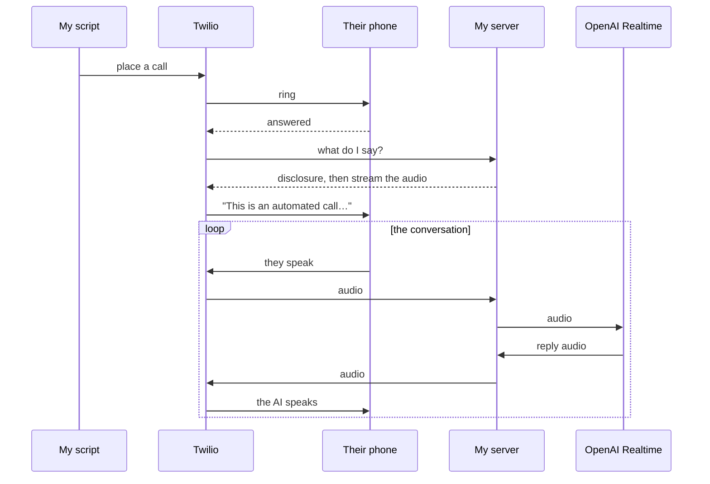

Can you plug an AI into the telephone network and have it hold a real
conversation? I wanted to find out; and more interesting to me, to see how
people react when the phone rings and it isn't a person.

**The tech part turned out to be relatively easy:** a weekend's work with Claude's help, and a few dollars in OpenAI and Twilio credits.

**The social part was surprising:** the people who tested it were happy to talk to the AI, until it tried to act human and friendly; at which point they found it weird and hung up.

**And the societal part is scary:** could this technology be used to run denial-of-service attacks on businesses or emergency call centres?

## The tech

The code is on GitHub: [**nestor**](https://github.com/guiguibaq/nestor)
(MIT, ~1,900 lines). You can try it yourself: add a contact and a prompt, then the following lines will call for you:

```bash
uv run call --contact alex --prompt catchup-dinner --dry-run   # rings you
uv run call --contact alex --prompt catchup-dinner --run       # rings Alex
```

The whole thing is three moving parts. A script asks **Twilio** to place the
call. When the person answers, Twilio calls back to a small server on my laptop
(reachable through a tunnel), which speaks the AI disclosure and then opens a
**WebSocket** carrying the raw call audio. That audio is bridged, frame by
frame, to the **OpenAI Realtime API**,  which listens and talks back down the
same pipe.



The details that make it actually work (no audio transcoding, and how to handle
someone talking over the AI mid-sentence) are written up in
[ARCHITECTURE.md](https://github.com/guiguibaq/nestor/blob/main/ARCHITECTURE.md).

## The first calls

So far I tested Nestor on a handful of friends and family. **Technically it holds up**: around 630 ms to respond, handles being interrupted, switched to French unprompted, and arranged a dinner without me.

**One thing that I got wrong: the human-AI relationship**. I wanted the human to engage with the AI, so **I asked the AI to make small talk with the human**. For each person, I gave the AI a detail about their recent life (e.g., they took a trip to *this* destination, they started *that* sport), and I instructed the AI to ask about it (e.g., *"how was your trip to Canada?"*). **This completely backfired.**

The calls went the same way every time. Nestor introduces itself as an AI: people are amused, and happy to keep talking. Then Nestor asks the personal question; and the person hangs up.
(only my dad, bless him, found the whole thing delightful and had a lovely bit of
small talk with the AI.)


I don't know if it's because it feels creepy that the AI knows a personal thing about you, or because people feel weird engaging in small talk with an AI. Probably both.

Either way the lesson is the same: **the AI shouldn't try to be
your mate.** It works far better as a
polite assistant with an obvious purpose.

> One note from my personal tests: in my mind, **the AI does not pass the Turing test yet** (although it's very close). The voice is excellent and the reactions are convincing, but something is slightly off (e.g., a small lag before it answers, a delivery that is too clean, no stumbles or half-finished words). It doesn’t quite flow the way people do. 

## The scary part

With this technology a bad actor can **jam phone lines, and for very cheap**. Imagine an AI that is good enough to sound *plausibly* human. It can call a business and hold the line, going on with the operator about some junk. Even if the operator suspects the caller sounds weird, operators are trained not to hang up; so they hold the line, blocking real humans from getting through.

This type of attack is not new; it's known as Telephony Denial of Service (TDoS). What is new is how cheap they are to run: before the attacker had to pay humans for each line they were holding; now they can just spin up several AI agents for **~5 cents per minute per line**.

Back of the envelope estimate, here is how cheap it would be to completely jam different types of businesses:

| Target | Lines to occupy | Rough cost to jam, per hour |
|---|---|---|
| Local business (vet, restaurant) | ~3 | **under $10** |
| National call centre (car rental, bank) | ~200 | **~$600** |
| A major city's 911 (NYC-scale) | ~500 | **~$1,500** |

The 911 example is the most worrying to me:
1. the consequences are obviously the worst (e.g., panic, deaths)
2. the defense is probably the hardest: 911 operators cannot just hang up if they find the caller weird (what if it's a real human on the line?)
3. only sophisticated actors (state-level) would attempt something this serious and this illegal,  but those are exactly the ones who can strip every tell: no watermark, real US phone lines, a voice tuned to sound like a genuine emergency, etc.

*To state the obvious: running any of this against a real business or emergency line is illegal, and this section is about why we should worry, not a recipe.*

## Next directions

There are three directions I'm curious about.

**Give it a real task.** Booking a restaurant is the obvious test: the other end
is expecting a transaction rather than a chat, which is exactly the mode that
seems to work.

**Stop people from hanging up.** Now that I know small talk is what breaks it, there's
a lot to try (e.g., the introduction, how fast the AI answers or changes topic) to make it sound more natural.

**Explore defences.** I am not yet sure which safeguard can be put in place on the defending side of the Denial of Service, and that's something I want to explore next.
