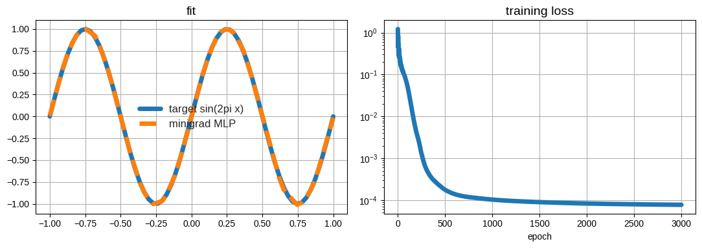
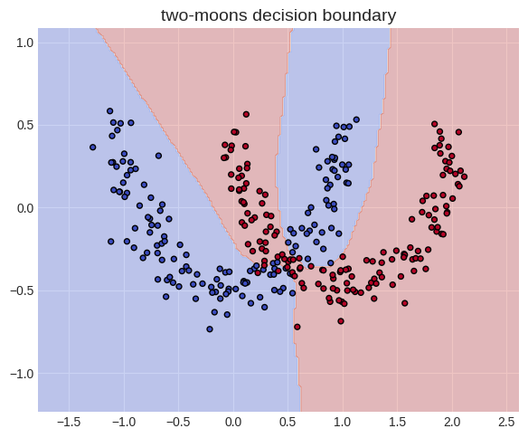

This is a simplified version of PyTorch autograd.

It follows the same philosophy as Karpathy's [micrograd](https://www.youtube.com/watch?v=VMj-3S1tku0), but gets closer to real PyTorch in two ways: **(i) it closely follows PyTorch's API** (two classes: one for data and one for logic), and **(ii) it supports numpy inputs**.

Those two additions brings a new set of *gotchas*, and are a great way to  understand Autograd more deeply.

## High level API
Similar to PyTorch, it uses two base classes:
* `Data` to stores the data and it's gradient. It is also the object from which we call `backward()`.
* `Function` to store the foward and backward logic of each operation

Here is a description of the API, and its comparison with PyTorch:
| minigrad | PyTorch | Description |
| --- | --- | --- |
| **Data** | **Tensor** | Holds the data nodes |
| ↳ .data | .data | the actual data |
| ↳ .requires_grad | .requires_grad | Whether we need to keep track of the gradient for this node (e.g., no need for input data)
| ↳ .grad | .grad | Stores the computed gradient (populated by `.backward()`)
| ↳ .backward() | .backward() | Computes gradients based on the computational graph |
| ↳ .grad_fn | .grad_fn | Maps to the Function instance that created this Data instance |
| | | |
| **Function** | **torch.autograd.Function** | Defines operations and their gradients |
| ↳ .forward() | .forward() | Computes output and saves context |
| ↳ .backward() | .backward() | Computes gradients for inputs |
| ↳ .save_for_backward() | ctx.save_for_backward() | Saves intermediate values for backward pass |
| ↳ .apply() | .apply() | Creates a new instance of the Class and call forward |
| ↳ .parents | n/a | Links to the Data instances that are parents of this Function instance |

The two classes `Data` and `Function` are then combined together in high-level classes that are easier to manipulate for building a real model.

| minigrad | PyTorch | Description |
| --- | --- | --- |
| **Layer** | **torch.nn.Module** | Base class for all neural network modules |
| ↳ Linear | torch.nn.Linear | A linear layer (fully connected layer) |
| ↳ MLP | torch.nn.Sequential / Custom `torch.nn.Module` | Multi-layer Perceptron |
| | | |
| **Activation Functions** | **torch.nn.functional** | Common non-linearities |
| ↳ ReLu | torch.nn.ReLU / F.relu | Rectified Linear Unit |
| ↳ Softmax | torch.nn.Softmax / F.softmax | Softmax function |
| | | |
| **Loss Functions** | **torch.nn** | Functions to quantify prediction error |
| ↳ CrossEntropy | torch.nn.CrossEntropyLoss | Cross-entropy loss for classification |
| | | |
| **SGD** | **torch.optim.SGD** | Implements stochastic gradient descent optimizer |

## Main take-aways and *gotchas*

Implementing minigrad was much more challenging than I originally thought. Here are the key tips and learnings:

### A *lot* happens when we do a simple operation like `Y = X @ W`
We instantiate a new matrix multiply object, save the activations,  perform the forward, and instantiate a new data object. So much packed in a one liner! See section #1.2

### The .backward() accumulates gradients in the leaves only
Main points for the backward():
* The backpropagation happens in the opposite order of the topological sort of the forward.
* The gradients accumulate in the leaves, which means that we sum the gradients rather that overwritting them
* When we run `.backward()` two times, the gradients accumulate *in the leaves only*: the gradient of the intermediate nodes is discarded.

See sections #2.2 and #2.3

### Any broadcast during the forward should be unbroadcast during the backward

Numpy automatically broadcasts arrays during the forward (e.g., the bias term of a linear layer), so we need to correctly unbroadcast them during the backward. See section #2.4.

### `Layers` find their parameters using recursive search
To find the learnable parameters of a `Layers`, we can recursively search among its parameters. See section #3.

## The output: a fully functional learning engine

Once all of this is done, we get a fully functional autograd. See part #3.

# 1. Base classes

PyTorch Autograd works around two main base classes: `Tensor` and `Function`. We follow a similar approach: our base classes are `Data` and `Function`.

We keep track of the computation graph by linking the instances: each `Function` keeps track of its input `Data` instances, and vice-versa.


## 1.1. `Data`

The base implementation of **Data** is relatively simple.

```python
import numpy as np

# class definition
class Data:
  def __init__(self, data: np.ndarray, requires_grad: bool = False, grad_fn: 'Function' = None):
    self.data = data
    self.grad: np.ndarray | None = None
    self.requires_grad = requires_grad
    self.grad_fn = grad_fn

  def __repr__(self) -> str:
    return f"Data(data={self.data}, grad={self.grad}, requires_grad={self.requires_grad}, grad_fn={self.grad_fn})"

  def backward(self) -> None:
    raise NotImplementedError() # we will complete this in section #2

  # --- ops: we will add all the operations below in section #1.2 and #1.3 ---
  def __matmul__(self, other: 'Data') -> 'Data':
    raise NotImplementedError()
```

## 1.2. `Function` - start with `MatMul` example

The implementation of `Function` is a bit more involved.

In this section we will show the idea of its implementation for a matrix multiplication; in the next section (#1.3.) we will implement the general case.

Let's consider a simple matrix multiplication:
```python
a = Data(np.array([1]), requires_grad=True)
b = Data(np.array([2]), requires_grad=True)
c = a @ b
```

**A lot is happening** behind the simple line `c = a @ b`:
1. A new instance of the class `Function` is created. We need a new instance, because we need to store specific attributes from *this* multiplication (e.g., the activations).
2. We save the specific *inputs* of the Function (so we know where to propagate the gradient during the backward), and the *activations* (to compute the backward).
3. We compute the forward
4. We create a new Tensor (called `Data` in this implementation) that contains the result of the matrix multiplication, and a reference to the function that created it.

**Let's break-down all those steps in pseudo-code:**
```python
a = Data([1], requires_grad=True)
b = Data([2], requires_grad=True)

# (1) create new instance of multiplication
mat_mul_instance = MatMul()
# (2) save the parents
mat_mul_instance.parents=[a, b]
# save activations for the backward
mat_mul_instance.save_for_backward(b, a)
# create a new tensor
out_data = mat_mul_instance.forward(a.data, b.data)
c = Data([out_data], requires_grad=True, grad_fn=mat_mul_instance)
```

That's clearer for a breakdown, but it's a lot to write everytime we make a multiplication! We can **make it more user-friendly** by doing the following:

1. Build a wrapper **`apply()`** that contains the **creation of the new instances `Function` and `Data`**.

```python
class MatMul:
  def __init__(self):
    self.parents = []

  def save_for_backward(self, *args: np.ndarray):
    self._saved = args

  @staticmethod
  def forward(ctx, a: np.ndarray, b: np.ndarray):
    ctx.save_for_backward(b.data, a.data) # we save the activation
    return a @ b

  @staticmethod
  def backward(cls, grad_in):
    raise NotImplementedError() # we will complete that in the next section

  @classmethod
  def apply(cls, a, b):
    ctx = cls() # cls() is Python for creating a new instance of the class - so ctx is an instance of MatMul that we just created
    ctx.parents = [a, b] # we save the parents of the newly created instance
    out_data = ctx.forward(ctx, a.data, b.data) # compute the data for output
    requires_grad = a.requires_grad or b.requires_grad
    return Data(out_data, grad_fn=ctx, requires_grad=requires_grad) # return a Data object

  def __repr__(self):
    return f"MatMul_{id(self)}"

# we call it as such:
a = Data(np.array([1]), requires_grad=True)
b = Data(np.array([2]), requires_grad=True)
c = MatMul.apply(a, b) # this single line creates two instances, one of the data (`c`), and one of the MatMul
print(f"c: {c}")

# under-the-hood this created a new matmul instance, which we can access through `.grad_fn` on `c`
print(f"\n MatMul instance: {c.grad_fn}")
```

    c: Data(data=2, grad=None, requires_grad=True, grad_fn=MatMul_134811646758976)
    
     MatMul instance: MatMul_134811646758976

2. **Wrap `apply()` in a symbol** so we can do `c = a @ b` instead of `c = MatMul.apply(a, b)`. To do so, we add the method `__matmul__` to the data:

<pre style="background-color: #1e1e1e; color: #d4d4d4; padding: 12px; border-radius: 6px; font-family: 'Fira Code', Consolas, monospace; font-size: 13px; line-height: 1.3; overflow-x: auto; margin: 0;"><span style="display: block; width: 100%; padding: 2px 5px; margin: 0; box-sizing: border-box;">  class Data:</span><span style="display: block; width: 100%; padding: 2px 5px; margin: 0; box-sizing: border-box;">    def __init__(self, data: np.ndarray, requires_grad: bool = False, grad_fn: 'Function' = None):</span><span style="display: block; width: 100%; padding: 2px 5px; margin: 0; box-sizing: border-box;">      self.data = data</span><span style="display: block; width: 100%; padding: 2px 5px; margin: 0; box-sizing: border-box;">      self.grad: np.ndarray | None = None</span><span style="display: block; width: 100%; padding: 2px 5px; margin: 0; box-sizing: border-box;">      self.requires_grad = requires_grad</span><span style="display: block; width: 100%; padding: 2px 5px; margin: 0; box-sizing: border-box;">      self.grad_fn = grad_fn</span><span style="display: block; width: 100%; padding: 2px 5px; margin: 0; box-sizing: border-box;">  </span><span style="display: block; width: 100%; padding: 2px 5px; margin: 0; box-sizing: border-box;">    def __repr__(self) -&gt; str:</span><span style="display: block; width: 100%; padding: 2px 5px; margin: 0; box-sizing: border-box;">      return f"Data(data={self.data}, grad={self.grad}, requires_grad={self.requires_grad}, grad_fn={self.grad_fn})"</span><span style="display: block; width: 100%; padding: 2px 5px; margin: 0; box-sizing: border-box;">  </span><span style="display: block; width: 100%; padding: 2px 5px; margin: 0; box-sizing: border-box;">    def backward(self) -&gt; None:</span><span style="display: block; width: 100%; padding: 2px 5px; margin: 0; box-sizing: border-box;">      raise NotImplementedError()</span><span style="display: block; width: 100%; padding: 2px 5px; margin: 0; box-sizing: border-box;">  </span><span style="display: block; width: 100%; padding: 2px 5px; margin: 0; box-sizing: border-box;">    def __matmul__(self, other: 'Data') -&gt; 'Data':</span><span style="background-color: #3b1e1e; color: #f14c4c; display: block; width: 100%; padding: 2px 5px; margin: 0; box-sizing: border-box;">-     raise NotImplementedError()</span><span style="background-color: #1e3b1e; color: #23d160; display: block; width: 100%; padding: 2px 5px; margin: 0; box-sizing: border-box;">+     return MatMul.apply(self, other)</span></pre>

Let's test it on a simple example:

```python
# we can now call it as such
a = Data(np.array([1]), requires_grad=True)
b = Data(np.array([2]), requires_grad=True)
c = a @ b # this single line creates two instances, one of the data (`c`), and one of the MatMul
print(f"c: {c}")
```

    c: Data(data=2, grad=None, requires_grad=True, grad_fn=MatMul_134811632068336)

## 1.3. Extend to more operations - and run the forward on an MLP

So far we saw only the example of MatMul, but we need much more operations. All of those will share the same base methods (e.g., `save_for_backward`, `apply`) and only differ by their implementation of `forward` and `backward`. So we create a base class `Function` from which they inherit.

```python
import numpy as np
from typing import Tuple, List, Any, Union

# -------
# This defines the base class
# -------
class Function:
  def __init__(self):
    self.parents: List['Data'] = []
    self._saved: Tuple[Any, ...] = ()

  def save_for_backward(self, *tensors: Any):
    self._saved = tensors

  @staticmethod
  def forward(ctx: Any, *args: np.ndarray, **kwargs: Any) -> np.ndarray:
    raise NotImplementedError() # should be implemented by the child class

  @staticmethod
  def backward(ctx: Any, grad_in: np.ndarray) -> Tuple[np.ndarray, ...]:
    raise NotImplementedError() # should be implemented by the child class

  @classmethod
  def apply(cls, *args: 'Data', **kwargs: Any) -> 'Data':
    # args are data, kwargs are extra parameters, like the exponent in a power

    # create instance of operator
    operation_instance = cls()
    operation_instance.parents = list(args)
    # operation_instance.save_for_backward() # save_for_backward is now called inside the forward method of each specific Function

    # create Data to be returned
    data_out = operation_instance.forward(operation_instance, *[arg.data for arg in args], **kwargs)
    requires_grad = any([arg.requires_grad for arg in args])
    return Data(data_out, requires_grad=requires_grad, grad_fn=operation_instance)

# -------
# Below are the sub classes (only the forwards for now)
# -------
class MatMul(Function):
  @staticmethod
  def forward(ctx: Any, a: np.ndarray, b: np.ndarray) -> np.ndarray:
    ctx.save_for_backward(a, b)
    return a @ b

class Add(Function):
  @staticmethod
  def forward(ctx: Any, a: np.ndarray, b: np.ndarray) -> np.ndarray:
    ctx.save_for_backward(a,b)
    return a + b

class Sub(Function):
  @staticmethod
  def forward(ctx: Any, a: np.ndarray, b: np.ndarray) -> np.ndarray:
    ctx.save_for_backward(a,b)
    return a - b

class Mul(Function):
  @staticmethod
  def forward(ctx: Any, a: np.ndarray, b: np.ndarray) -> np.ndarray:
    ctx.save_for_backward(a, b)
    return a * b

class Div(Function):
  @staticmethod
  def forward(ctx: Any, a: np.ndarray, b: np.ndarray) -> np.ndarray:
    ctx.save_for_backward(a, b)
    return a / b

class Neg(Function):
  @staticmethod
  def forward(ctx: Any, a: np.ndarray) -> np.ndarray:
    ctx.save_for_backward(a)
    return -a

class Pow(Function):
  @staticmethod
  def forward(ctx: Any, a: np.ndarray, exponent: int) -> np.ndarray:
    ctx.save_for_backward(a)
    ctx.exponent = exponent
    return a**exponent

class Exp(Function):
  @staticmethod
  def forward(ctx: Any, a: np.ndarray) -> np.ndarray:
    ctx.save_for_backward(a)
    return np.exp(a)

class Log(Function):
  @staticmethod
  def forward(ctx: Any, a: np.ndarray) -> np.ndarray:
    ctx.save_for_backward(a)
    return np.log(a)

class ReLu(Function):
  @staticmethod
  def forward(ctx: Any, a: np.ndarray) -> np.ndarray:
    ctx.save_for_backward(a)
    return np.maximum(a, 0)

class Sum(Function):
  @staticmethod
  def forward(ctx: Any, a: np.ndarray, axis: Union[int, Tuple[int, ...], None] = None, keepdims: bool = False) -> np.ndarray:
    ctx.in_shape = a.shape
    ctx.axis = axis
    ctx.keepdims = keepdims
    return a.sum(axis=axis, keepdims=keepdims)

class Mean(Function):
  @staticmethod
  def forward(ctx: Any, a: np.ndarray, axis: Union[int, Tuple[int, ...], None] = None, keepdims: bool = False) -> np.ndarray:
    ctx.in_shape = a.shape
    ctx.axis = axis
    ctx.keepdims = keepdims
    return a.mean(axis=axis, keepdims=keepdims)

class Reshape(Function):
  @staticmethod
  def forward(ctx: Any, x: np.ndarray, shape: Tuple[int, ...]) -> np.ndarray:
    ctx.in_shape = x.shape
    return x.reshape(shape)

class Transpose(Function):
  @staticmethod
  def forward(ctx: Any, x: np.ndarray) -> np.ndarray:
    return x.T
```

We also add the symbols to the Data class

<pre style="background-color: #1e1e1e; color: #d4d4d4; padding: 12px; border-radius: 6px; font-family: 'Fira Code', Consolas, monospace; font-size: 13px; line-height: 1.3; overflow-x: auto; margin: 0;"><span style="display: block; width: 100%; padding: 2px 5px; margin: 0; box-sizing: border-box;">  class Data:</span><span style="display: block; width: 100%; padding: 2px 5px; margin: 0; box-sizing: border-box;">    def __init__(self, data: np.ndarray, requires_grad: bool = False, grad_fn: 'Function' = None):</span><span style="display: block; width: 100%; padding: 2px 5px; margin: 0; box-sizing: border-box;">      self.data = data</span><span style="display: block; width: 100%; padding: 2px 5px; margin: 0; box-sizing: border-box;">      self.grad: np.ndarray | None = None</span><span style="display: block; width: 100%; padding: 2px 5px; margin: 0; box-sizing: border-box;">      self.requires_grad = requires_grad</span><span style="display: block; width: 100%; padding: 2px 5px; margin: 0; box-sizing: border-box;">      self.grad_fn = grad_fn</span><span style="display: block; width: 100%; padding: 2px 5px; margin: 0; box-sizing: border-box;">  </span><span style="display: block; width: 100%; padding: 2px 5px; margin: 0; box-sizing: border-box;">    def __repr__(self) -&gt; str:</span><span style="display: block; width: 100%; padding: 2px 5px; margin: 0; box-sizing: border-box;">      return f"Data(data={self.data}, grad={self.grad}, requires_grad={self.requires_grad}, grad_fn={self.grad_fn})"</span><span style="display: block; width: 100%; padding: 2px 5px; margin: 0; box-sizing: border-box;">  </span><span style="display: block; width: 100%; padding: 2px 5px; margin: 0; box-sizing: border-box;">    def backward(self) -&gt; None:</span><span style="display: block; width: 100%; padding: 2px 5px; margin: 0; box-sizing: border-box;">      raise NotImplementedError()</span><span style="display: block; width: 100%; padding: 2px 5px; margin: 0; box-sizing: border-box;">  </span><span style="background-color: #1e3b1e; color: #23d160; display: block; width: 100%; padding: 2px 5px; margin: 0; box-sizing: border-box;">+   def __add__(self, other: 'Data') -&gt; 'Data':</span><span style="background-color: #1e3b1e; color: #23d160; display: block; width: 100%; padding: 2px 5px; margin: 0; box-sizing: border-box;">+     return Add.apply(self, other)</span><span style="background-color: #1e3b1e; color: #23d160; display: block; width: 100%; padding: 2px 5px; margin: 0; box-sizing: border-box;">+ </span><span style="background-color: #1e3b1e; color: #23d160; display: block; width: 100%; padding: 2px 5px; margin: 0; box-sizing: border-box;">+   def __radd__(self, other: 'Data') -&gt; 'Data':</span><span style="background-color: #1e3b1e; color: #23d160; display: block; width: 100%; padding: 2px 5px; margin: 0; box-sizing: border-box;">+     return Add.apply(other, self)</span><span style="background-color: #1e3b1e; color: #23d160; display: block; width: 100%; padding: 2px 5px; margin: 0; box-sizing: border-box;">+ </span><span style="display: block; width: 100%; padding: 2px 5px; margin: 0; box-sizing: border-box;">    def __matmul__(self, other: 'Data') -&gt; 'Data':</span><span style="display: block; width: 100%; padding: 2px 5px; margin: 0; box-sizing: border-box;">      return MatMul.apply(self, other)</span><span style="background-color: #1e3b1e; color: #23d160; display: block; width: 100%; padding: 2px 5px; margin: 0; box-sizing: border-box;">+ </span><span style="background-color: #1e3b1e; color: #23d160; display: block; width: 100%; padding: 2px 5px; margin: 0; box-sizing: border-box;">+   def __sub__(self, other: 'Data') -&gt; 'Data':</span><span style="background-color: #1e3b1e; color: #23d160; display: block; width: 100%; padding: 2px 5px; margin: 0; box-sizing: border-box;">+     return Sub.apply(self, other)</span><span style="background-color: #1e3b1e; color: #23d160; display: block; width: 100%; padding: 2px 5px; margin: 0; box-sizing: border-box;">+ </span><span style="background-color: #1e3b1e; color: #23d160; display: block; width: 100%; padding: 2px 5px; margin: 0; box-sizing: border-box;">+   def __rsub__(self, other: 'Data') -&gt; 'Data':</span><span style="background-color: #1e3b1e; color: #23d160; display: block; width: 100%; padding: 2px 5px; margin: 0; box-sizing: border-box;">+     return Sub.apply(other, self)</span><span style="background-color: #1e3b1e; color: #23d160; display: block; width: 100%; padding: 2px 5px; margin: 0; box-sizing: border-box;">+ </span><span style="background-color: #1e3b1e; color: #23d160; display: block; width: 100%; padding: 2px 5px; margin: 0; box-sizing: border-box;">+   def __mul__(self, other: 'Data') -&gt; 'Data':</span><span style="background-color: #1e3b1e; color: #23d160; display: block; width: 100%; padding: 2px 5px; margin: 0; box-sizing: border-box;">+     return Mul.apply(self, other)</span><span style="background-color: #1e3b1e; color: #23d160; display: block; width: 100%; padding: 2px 5px; margin: 0; box-sizing: border-box;">+ </span><span style="background-color: #1e3b1e; color: #23d160; display: block; width: 100%; padding: 2px 5px; margin: 0; box-sizing: border-box;">+   def __rmul__(self, other: 'Data') -&gt; 'Data':</span><span style="background-color: #1e3b1e; color: #23d160; display: block; width: 100%; padding: 2px 5px; margin: 0; box-sizing: border-box;">+     return Mul.apply(other, self)</span><span style="background-color: #1e3b1e; color: #23d160; display: block; width: 100%; padding: 2px 5px; margin: 0; box-sizing: border-box;">+ </span><span style="background-color: #1e3b1e; color: #23d160; display: block; width: 100%; padding: 2px 5px; margin: 0; box-sizing: border-box;">+   def __truediv__(self, other: 'Data') -&gt; 'Data':</span><span style="background-color: #1e3b1e; color: #23d160; display: block; width: 100%; padding: 2px 5px; margin: 0; box-sizing: border-box;">+     return Div.apply(self, other)</span><span style="background-color: #1e3b1e; color: #23d160; display: block; width: 100%; padding: 2px 5px; margin: 0; box-sizing: border-box;">+ </span><span style="background-color: #1e3b1e; color: #23d160; display: block; width: 100%; padding: 2px 5px; margin: 0; box-sizing: border-box;">+   def __rtruediv__(self, other: 'Data') -&gt; 'Data':</span><span style="background-color: #1e3b1e; color: #23d160; display: block; width: 100%; padding: 2px 5px; margin: 0; box-sizing: border-box;">+     return Div.apply(other, self)</span><span style="background-color: #1e3b1e; color: #23d160; display: block; width: 100%; padding: 2px 5px; margin: 0; box-sizing: border-box;">+ </span><span style="background-color: #1e3b1e; color: #23d160; display: block; width: 100%; padding: 2px 5px; margin: 0; box-sizing: border-box;">+   def __neg__(self) -&gt; 'Data':</span><span style="background-color: #1e3b1e; color: #23d160; display: block; width: 100%; padding: 2px 5px; margin: 0; box-sizing: border-box;">+     return Neg.apply(self)</span><span style="background-color: #1e3b1e; color: #23d160; display: block; width: 100%; padding: 2px 5px; margin: 0; box-sizing: border-box;">+ </span><span style="background-color: #1e3b1e; color: #23d160; display: block; width: 100%; padding: 2px 5px; margin: 0; box-sizing: border-box;">+   def __pow__(self, exponent: int) -&gt; 'Data':</span><span style="background-color: #1e3b1e; color: #23d160; display: block; width: 100%; padding: 2px 5px; margin: 0; box-sizing: border-box;">+     return Pow.apply(self, exponent=exponent)</span><span style="background-color: #1e3b1e; color: #23d160; display: block; width: 100%; padding: 2px 5px; margin: 0; box-sizing: border-box;">+ </span><span style="background-color: #1e3b1e; color: #23d160; display: block; width: 100%; padding: 2px 5px; margin: 0; box-sizing: border-box;">+   def exp(self) -&gt; 'Data':</span><span style="background-color: #1e3b1e; color: #23d160; display: block; width: 100%; padding: 2px 5px; margin: 0; box-sizing: border-box;">+     return Exp.apply(self)</span><span style="background-color: #1e3b1e; color: #23d160; display: block; width: 100%; padding: 2px 5px; margin: 0; box-sizing: border-box;">+ </span><span style="background-color: #1e3b1e; color: #23d160; display: block; width: 100%; padding: 2px 5px; margin: 0; box-sizing: border-box;">+   def log(self) -&gt; 'Data':</span><span style="background-color: #1e3b1e; color: #23d160; display: block; width: 100%; padding: 2px 5px; margin: 0; box-sizing: border-box;">+     return Log.apply(self)</span><span style="background-color: #1e3b1e; color: #23d160; display: block; width: 100%; padding: 2px 5px; margin: 0; box-sizing: border-box;">+ </span><span style="background-color: #1e3b1e; color: #23d160; display: block; width: 100%; padding: 2px 5px; margin: 0; box-sizing: border-box;">+   def relu(self) -&gt; 'Data':</span><span style="background-color: #1e3b1e; color: #23d160; display: block; width: 100%; padding: 2px 5px; margin: 0; box-sizing: border-box;">+     return ReLu.apply(self)</span><span style="background-color: #1e3b1e; color: #23d160; display: block; width: 100%; padding: 2px 5px; margin: 0; box-sizing: border-box;">+ </span><span style="background-color: #1e3b1e; color: #23d160; display: block; width: 100%; padding: 2px 5px; margin: 0; box-sizing: border-box;">+   def sum(self, axis: Union[int, Tuple[int, ...], None] = None, keepdims: bool = False) -&gt; 'Data':</span><span style="background-color: #1e3b1e; color: #23d160; display: block; width: 100%; padding: 2px 5px; margin: 0; box-sizing: border-box;">+     return Sum.apply(self, axis=axis, keepdims=keepdims)</span><span style="background-color: #1e3b1e; color: #23d160; display: block; width: 100%; padding: 2px 5px; margin: 0; box-sizing: border-box;">+ </span><span style="background-color: #1e3b1e; color: #23d160; display: block; width: 100%; padding: 2px 5px; margin: 0; box-sizing: border-box;">+   def mean(self, axis: Union[int, Tuple[int, ...], None] = None, keepdims: bool = False) -&gt; 'Data':</span><span style="background-color: #1e3b1e; color: #23d160; display: block; width: 100%; padding: 2px 5px; margin: 0; box-sizing: border-box;">+     return Mean.apply(self, axis=axis, keepdims=keepdims)</span><span style="background-color: #1e3b1e; color: #23d160; display: block; width: 100%; padding: 2px 5px; margin: 0; box-sizing: border-box;">+ </span><span style="background-color: #1e3b1e; color: #23d160; display: block; width: 100%; padding: 2px 5px; margin: 0; box-sizing: border-box;">+   def reshape(self, shape: Tuple[int, ...]) -&gt; 'Data':</span><span style="background-color: #1e3b1e; color: #23d160; display: block; width: 100%; padding: 2px 5px; margin: 0; box-sizing: border-box;">+     return Reshape.apply(self, shape)</span><span style="background-color: #1e3b1e; color: #23d160; display: block; width: 100%; padding: 2px 5px; margin: 0; box-sizing: border-box;">+ </span><span style="background-color: #1e3b1e; color: #23d160; display: block; width: 100%; padding: 2px 5px; margin: 0; box-sizing: border-box;">+   @property</span><span style="background-color: #1e3b1e; color: #23d160; display: block; width: 100%; padding: 2px 5px; margin: 0; box-sizing: border-box;">+   def T(self) -&gt; 'Data':</span><span style="background-color: #1e3b1e; color: #23d160; display: block; width: 100%; padding: 2px 5px; margin: 0; box-sizing: border-box;">+     return Transpose.apply(self)</span></pre>

Test on the forward of an MLP:

```python
# Implementing the forward for an MLP

# dimenssions
batch = 50
dim_in = 10
dim_hidden = 20

# data
X = Data(data=np.random.rand(50, dim_in))
label = Data(data=np.random.rand(50, 1))

# weights and bias
W1 = Data(data=np.random.rand(dim_hidden, dim_in), requires_grad=True)
b1 = Data(data=np.random.rand(1, 1), requires_grad=True)

W2 = Data(data=np.random.rand(1, dim_hidden), requires_grad=True)
b2 = Data(data=np.random.rand(1, 1), requires_grad=True)

# forward
Z = ReLu.apply(X @ W1.T + b1)
Y_hat = Z @ W2.T + b2

# loss
loss = ((Y_hat - label) ** 2).mean()

assert(
    loss.data == np.mean((np.maximum(X.data @ W1.data.T + b1.data, 0) @ W2.data.T + b2.data - label.data)**2)
)
```

# 2. Backward

To run the backward, we need to add two main elements to our implementation so far:
1. The chain-rule logic on each function, that we will store in `backward`
2. The propagation of the chain-rule through the compute graph

## 2.1. Chain-rule logic

We implement `backward` for each class: they take a gradient in, and output as many gradients as they have inputs.

<pre style="background-color: #1e1e1e; color: #d4d4d4; padding: 12px; border-radius: 6px; font-family: 'Fira Code', Consolas, monospace; font-size: 13px; line-height: 1.3; overflow-x: auto; margin: 0;"><span style="display: block; width: 100%; padding: 2px 5px; margin: 0; box-sizing: border-box;">  class MatMul(Function):</span><span style="display: block; width: 100%; padding: 2px 5px; margin: 0; box-sizing: border-box;">    @staticmethod</span><span style="display: block; width: 100%; padding: 2px 5px; margin: 0; box-sizing: border-box;">    def forward(ctx: Any, a: np.ndarray, b: np.ndarray) -&gt; np.ndarray:</span><span style="display: block; width: 100%; padding: 2px 5px; margin: 0; box-sizing: border-box;">      ctx.save_for_backward(a, b)</span><span style="display: block; width: 100%; padding: 2px 5px; margin: 0; box-sizing: border-box;">      return a @ b</span><span style="background-color: #1e3b1e; color: #23d160; display: block; width: 100%; padding: 2px 5px; margin: 0; box-sizing: border-box;">+ </span><span style="background-color: #1e3b1e; color: #23d160; display: block; width: 100%; padding: 2px 5px; margin: 0; box-sizing: border-box;">+   @staticmethod</span><span style="background-color: #1e3b1e; color: #23d160; display: block; width: 100%; padding: 2px 5px; margin: 0; box-sizing: border-box;">+   def backward(ctx: Any, grad_in: np.ndarray) -&gt; Tuple[np.ndarray, np.ndarray]:</span><span style="background-color: #1e3b1e; color: #23d160; display: block; width: 100%; padding: 2px 5px; margin: 0; box-sizing: border-box;">+     a, b = ctx._saved</span><span style="background-color: #1e3b1e; color: #23d160; display: block; width: 100%; padding: 2px 5px; margin: 0; box-sizing: border-box;">+     return grad_in @ b.T, a.T @ grad_in</span><span style="display: block; width: 100%; padding: 2px 5px; margin: 0; box-sizing: border-box;">  </span><span style="display: block; width: 100%; padding: 2px 5px; margin: 0; box-sizing: border-box;">  class Add(Function):</span><span style="display: block; width: 100%; padding: 2px 5px; margin: 0; box-sizing: border-box;">    @staticmethod</span><span style="display: block; width: 100%; padding: 2px 5px; margin: 0; box-sizing: border-box;">    def forward(ctx: Any, a: np.ndarray, b: np.ndarray) -&gt; np.ndarray:</span><span style="display: block; width: 100%; padding: 2px 5px; margin: 0; box-sizing: border-box;">      ctx.save_for_backward(a,b)</span><span style="display: block; width: 100%; padding: 2px 5px; margin: 0; box-sizing: border-box;">      return a + b</span><span style="display: block; width: 100%; padding: 2px 5px; margin: 0; box-sizing: border-box;">  </span><span style="background-color: #1e3b1e; color: #23d160; display: block; width: 100%; padding: 2px 5px; margin: 0; box-sizing: border-box;">+   @staticmethod</span><span style="background-color: #1e3b1e; color: #23d160; display: block; width: 100%; padding: 2px 5px; margin: 0; box-sizing: border-box;">+   def backward(ctx: Any, grad_in: np.ndarray) -&gt; Tuple[np.ndarray, np.ndarray]:</span><span style="background-color: #1e3b1e; color: #23d160; display: block; width: 100%; padding: 2px 5px; margin: 0; box-sizing: border-box;">+     return grad_in, grad_in</span><span style="background-color: #1e3b1e; color: #23d160; display: block; width: 100%; padding: 2px 5px; margin: 0; box-sizing: border-box;">+ </span><span style="display: block; width: 100%; padding: 2px 5px; margin: 0; box-sizing: border-box;">  class Sub(Function):</span><span style="display: block; width: 100%; padding: 2px 5px; margin: 0; box-sizing: border-box;">    @staticmethod</span><span style="display: block; width: 100%; padding: 2px 5px; margin: 0; box-sizing: border-box;">    def forward(ctx: Any, a: np.ndarray, b: np.ndarray) -&gt; np.ndarray:</span><span style="display: block; width: 100%; padding: 2px 5px; margin: 0; box-sizing: border-box;">      ctx.save_for_backward(a,b)</span><span style="display: block; width: 100%; padding: 2px 5px; margin: 0; box-sizing: border-box;">      return a - b</span><span style="background-color: #1e3b1e; color: #23d160; display: block; width: 100%; padding: 2px 5px; margin: 0; box-sizing: border-box;">+ </span><span style="background-color: #1e3b1e; color: #23d160; display: block; width: 100%; padding: 2px 5px; margin: 0; box-sizing: border-box;">+   @staticmethod</span><span style="background-color: #1e3b1e; color: #23d160; display: block; width: 100%; padding: 2px 5px; margin: 0; box-sizing: border-box;">+   def backward(ctx: Any, grad_in: np.ndarray) -&gt; Tuple[np.ndarray, np.ndarray]:</span><span style="background-color: #1e3b1e; color: #23d160; display: block; width: 100%; padding: 2px 5px; margin: 0; box-sizing: border-box;">+     return grad_in, -grad_in</span><span style="display: block; width: 100%; padding: 2px 5px; margin: 0; box-sizing: border-box;">  </span><span style="display: block; width: 100%; padding: 2px 5px; margin: 0; box-sizing: border-box;">  class Mul(Function):</span><span style="display: block; width: 100%; padding: 2px 5px; margin: 0; box-sizing: border-box;">    @staticmethod</span><span style="display: block; width: 100%; padding: 2px 5px; margin: 0; box-sizing: border-box;">    def forward(ctx: Any, a: np.ndarray, b: np.ndarray) -&gt; np.ndarray:</span><span style="display: block; width: 100%; padding: 2px 5px; margin: 0; box-sizing: border-box;">      ctx.save_for_backward(a, b)</span><span style="display: block; width: 100%; padding: 2px 5px; margin: 0; box-sizing: border-box;">      return a * b</span><span style="display: block; width: 100%; padding: 2px 5px; margin: 0; box-sizing: border-box;">  </span><span style="background-color: #1e3b1e; color: #23d160; display: block; width: 100%; padding: 2px 5px; margin: 0; box-sizing: border-box;">+   @staticmethod</span><span style="background-color: #1e3b1e; color: #23d160; display: block; width: 100%; padding: 2px 5px; margin: 0; box-sizing: border-box;">+   def backward(ctx: Any, grad_in: np.ndarray) -&gt; Tuple[np.ndarray, np.ndarray]:</span><span style="background-color: #1e3b1e; color: #23d160; display: block; width: 100%; padding: 2px 5px; margin: 0; box-sizing: border-box;">+     a, b = ctx._saved</span><span style="background-color: #1e3b1e; color: #23d160; display: block; width: 100%; padding: 2px 5px; margin: 0; box-sizing: border-box;">+     return grad_in * b, grad_in * a</span><span style="background-color: #1e3b1e; color: #23d160; display: block; width: 100%; padding: 2px 5px; margin: 0; box-sizing: border-box;">+ </span><span style="background-color: #1e3b1e; color: #23d160; display: block; width: 100%; padding: 2px 5px; margin: 0; box-sizing: border-box;">+ </span><span style="display: block; width: 100%; padding: 2px 5px; margin: 0; box-sizing: border-box;">  class Div(Function):</span><span style="display: block; width: 100%; padding: 2px 5px; margin: 0; box-sizing: border-box;">    @staticmethod</span><span style="display: block; width: 100%; padding: 2px 5px; margin: 0; box-sizing: border-box;">    def forward(ctx: Any, a: np.ndarray, b: np.ndarray) -&gt; np.ndarray:</span><span style="display: block; width: 100%; padding: 2px 5px; margin: 0; box-sizing: border-box;">      ctx.save_for_backward(a, b)</span><span style="display: block; width: 100%; padding: 2px 5px; margin: 0; box-sizing: border-box;">      return a / b</span><span style="display: block; width: 100%; padding: 2px 5px; margin: 0; box-sizing: border-box;">  </span><span style="background-color: #1e3b1e; color: #23d160; display: block; width: 100%; padding: 2px 5px; margin: 0; box-sizing: border-box;">+   @staticmethod</span><span style="background-color: #1e3b1e; color: #23d160; display: block; width: 100%; padding: 2px 5px; margin: 0; box-sizing: border-box;">+   def backward(ctx: Any, grad_in: np.ndarray) -&gt; Tuple[np.ndarray, np.ndarray]:</span><span style="background-color: #1e3b1e; color: #23d160; display: block; width: 100%; padding: 2px 5px; margin: 0; box-sizing: border-box;">+     a, b = ctx._saved</span><span style="background-color: #1e3b1e; color: #23d160; display: block; width: 100%; padding: 2px 5px; margin: 0; box-sizing: border-box;">+     return grad_in / b, - grad_in * a / b**2</span><span style="background-color: #1e3b1e; color: #23d160; display: block; width: 100%; padding: 2px 5px; margin: 0; box-sizing: border-box;">+ </span><span style="display: block; width: 100%; padding: 2px 5px; margin: 0; box-sizing: border-box;">  class Neg(Function):</span><span style="display: block; width: 100%; padding: 2px 5px; margin: 0; box-sizing: border-box;">    @staticmethod</span><span style="display: block; width: 100%; padding: 2px 5px; margin: 0; box-sizing: border-box;">    def forward(ctx: Any, a: np.ndarray) -&gt; np.ndarray:</span><span style="display: block; width: 100%; padding: 2px 5px; margin: 0; box-sizing: border-box;">      ctx.save_for_backward(a)</span><span style="display: block; width: 100%; padding: 2px 5px; margin: 0; box-sizing: border-box;">      return -a</span><span style="background-color: #1e3b1e; color: #23d160; display: block; width: 100%; padding: 2px 5px; margin: 0; box-sizing: border-box;">+ </span><span style="background-color: #1e3b1e; color: #23d160; display: block; width: 100%; padding: 2px 5px; margin: 0; box-sizing: border-box;">+   @staticmethod</span><span style="background-color: #1e3b1e; color: #23d160; display: block; width: 100%; padding: 2px 5px; margin: 0; box-sizing: border-box;">+   def backward(ctx: Any, grad_in: np.ndarray) -&gt; Tuple[np.ndarray,]:</span><span style="background-color: #1e3b1e; color: #23d160; display: block; width: 100%; padding: 2px 5px; margin: 0; box-sizing: border-box;">+     return (-grad_in,)</span><span style="display: block; width: 100%; padding: 2px 5px; margin: 0; box-sizing: border-box;">  </span><span style="display: block; width: 100%; padding: 2px 5px; margin: 0; box-sizing: border-box;">  class Pow(Function):</span><span style="display: block; width: 100%; padding: 2px 5px; margin: 0; box-sizing: border-box;">    @staticmethod</span><span style="display: block; width: 100%; padding: 2px 5px; margin: 0; box-sizing: border-box;">    def forward(ctx: Any, a: np.ndarray, exponent: int) -&gt; np.ndarray:</span><span style="display: block; width: 100%; padding: 2px 5px; margin: 0; box-sizing: border-box;">      ctx.save_for_backward(a)</span><span style="display: block; width: 100%; padding: 2px 5px; margin: 0; box-sizing: border-box;">      ctx.exponent = exponent</span><span style="display: block; width: 100%; padding: 2px 5px; margin: 0; box-sizing: border-box;">      return a**exponent</span><span style="display: block; width: 100%; padding: 2px 5px; margin: 0; box-sizing: border-box;">  </span><span style="background-color: #1e3b1e; color: #23d160; display: block; width: 100%; padding: 2px 5px; margin: 0; box-sizing: border-box;">+   @staticmethod</span><span style="background-color: #1e3b1e; color: #23d160; display: block; width: 100%; padding: 2px 5px; margin: 0; box-sizing: border-box;">+   def backward(ctx: Any, grad_in: np.ndarray) -&gt; Tuple[np.ndarray,]:</span><span style="background-color: #1e3b1e; color: #23d160; display: block; width: 100%; padding: 2px 5px; margin: 0; box-sizing: border-box;">+     a = ctx._saved[0]</span><span style="background-color: #1e3b1e; color: #23d160; display: block; width: 100%; padding: 2px 5px; margin: 0; box-sizing: border-box;">+     return (grad_in * ctx.exponent * a ** (ctx.exponent - 1),)</span><span style="background-color: #1e3b1e; color: #23d160; display: block; width: 100%; padding: 2px 5px; margin: 0; box-sizing: border-box;">+ </span><span style="display: block; width: 100%; padding: 2px 5px; margin: 0; box-sizing: border-box;">  class Exp(Function):</span><span style="display: block; width: 100%; padding: 2px 5px; margin: 0; box-sizing: border-box;">    @staticmethod</span><span style="display: block; width: 100%; padding: 2px 5px; margin: 0; box-sizing: border-box;">    def forward(ctx: Any, a: np.ndarray) -&gt; np.ndarray:</span><span style="display: block; width: 100%; padding: 2px 5px; margin: 0; box-sizing: border-box;">      ctx.save_for_backward(a)</span><span style="display: block; width: 100%; padding: 2px 5px; margin: 0; box-sizing: border-box;">      return np.exp(a)</span><span style="background-color: #1e3b1e; color: #23d160; display: block; width: 100%; padding: 2px 5px; margin: 0; box-sizing: border-box;">+ </span><span style="background-color: #1e3b1e; color: #23d160; display: block; width: 100%; padding: 2px 5px; margin: 0; box-sizing: border-box;">+   @staticmethod</span><span style="background-color: #1e3b1e; color: #23d160; display: block; width: 100%; padding: 2px 5px; margin: 0; box-sizing: border-box;">+   def backward(ctx: Any, grad_in: np.ndarray) -&gt; Tuple[np.ndarray,]:</span><span style="background-color: #1e3b1e; color: #23d160; display: block; width: 100%; padding: 2px 5px; margin: 0; box-sizing: border-box;">+     a = ctx._saved[0]</span><span style="background-color: #1e3b1e; color: #23d160; display: block; width: 100%; padding: 2px 5px; margin: 0; box-sizing: border-box;">+     return (grad_in * np.exp(a),)</span><span style="display: block; width: 100%; padding: 2px 5px; margin: 0; box-sizing: border-box;">  </span><span style="display: block; width: 100%; padding: 2px 5px; margin: 0; box-sizing: border-box;">  class Log(Function):</span><span style="display: block; width: 100%; padding: 2px 5px; margin: 0; box-sizing: border-box;">    @staticmethod</span><span style="display: block; width: 100%; padding: 2px 5px; margin: 0; box-sizing: border-box;">    def forward(ctx: Any, a: np.ndarray) -&gt; np.ndarray:</span><span style="display: block; width: 100%; padding: 2px 5px; margin: 0; box-sizing: border-box;">      ctx.save_for_backward(a)</span><span style="display: block; width: 100%; padding: 2px 5px; margin: 0; box-sizing: border-box;">      return np.log(a)</span><span style="display: block; width: 100%; padding: 2px 5px; margin: 0; box-sizing: border-box;">  </span><span style="background-color: #1e3b1e; color: #23d160; display: block; width: 100%; padding: 2px 5px; margin: 0; box-sizing: border-box;">+   @staticmethod</span><span style="background-color: #1e3b1e; color: #23d160; display: block; width: 100%; padding: 2px 5px; margin: 0; box-sizing: border-box;">+   def backward(ctx: Any, grad_in: np.ndarray) -&gt; Tuple[np.ndarray,]:</span><span style="background-color: #1e3b1e; color: #23d160; display: block; width: 100%; padding: 2px 5px; margin: 0; box-sizing: border-box;">+     a = ctx._saved[0]</span><span style="background-color: #1e3b1e; color: #23d160; display: block; width: 100%; padding: 2px 5px; margin: 0; box-sizing: border-box;">+     return (grad_in / a,)</span><span style="background-color: #1e3b1e; color: #23d160; display: block; width: 100%; padding: 2px 5px; margin: 0; box-sizing: border-box;">+ </span><span style="display: block; width: 100%; padding: 2px 5px; margin: 0; box-sizing: border-box;">  class ReLu(Function):</span><span style="display: block; width: 100%; padding: 2px 5px; margin: 0; box-sizing: border-box;">    @staticmethod</span><span style="display: block; width: 100%; padding: 2px 5px; margin: 0; box-sizing: border-box;">    def forward(ctx: Any, a: np.ndarray) -&gt; np.ndarray:</span><span style="display: block; width: 100%; padding: 2px 5px; margin: 0; box-sizing: border-box;">      ctx.save_for_backward(a)</span><span style="display: block; width: 100%; padding: 2px 5px; margin: 0; box-sizing: border-box;">      return np.maximum(a, 0)</span><span style="background-color: #1e3b1e; color: #23d160; display: block; width: 100%; padding: 2px 5px; margin: 0; box-sizing: border-box;">+ </span><span style="background-color: #1e3b1e; color: #23d160; display: block; width: 100%; padding: 2px 5px; margin: 0; box-sizing: border-box;">+   @staticmethod</span><span style="background-color: #1e3b1e; color: #23d160; display: block; width: 100%; padding: 2px 5px; margin: 0; box-sizing: border-box;">+   def backward(ctx: Any, grad_in: np.ndarray) -&gt; Tuple[np.ndarray,]:</span><span style="background-color: #1e3b1e; color: #23d160; display: block; width: 100%; padding: 2px 5px; margin: 0; box-sizing: border-box;">+     a = ctx._saved[0]</span><span style="background-color: #1e3b1e; color: #23d160; display: block; width: 100%; padding: 2px 5px; margin: 0; box-sizing: border-box;">+     return (grad_in * (a &gt; 0),)</span><span style="display: block; width: 100%; padding: 2px 5px; margin: 0; box-sizing: border-box;">  </span><span style="display: block; width: 100%; padding: 2px 5px; margin: 0; box-sizing: border-box;">  class Sum(Function):</span><span style="display: block; width: 100%; padding: 2px 5px; margin: 0; box-sizing: border-box;">    @staticmethod</span><span style="display: block; width: 100%; padding: 2px 5px; margin: 0; box-sizing: border-box;">    def forward(ctx: Any, a: np.ndarray, axis: Union[int, Tuple[int, ...], None] = None, keepdims: bool = False) -&gt; np.ndarray:</span><span style="display: block; width: 100%; padding: 2px 5px; margin: 0; box-sizing: border-box;">      ctx.in_shape = a.shape</span><span style="display: block; width: 100%; padding: 2px 5px; margin: 0; box-sizing: border-box;">      ctx.axis = axis</span><span style="display: block; width: 100%; padding: 2px 5px; margin: 0; box-sizing: border-box;">      ctx.keepdims = keepdims</span><span style="display: block; width: 100%; padding: 2px 5px; margin: 0; box-sizing: border-box;">      return a.sum(axis=axis, keepdims=keepdims)</span><span style="display: block; width: 100%; padding: 2px 5px; margin: 0; box-sizing: border-box;">  </span><span style="background-color: #1e3b1e; color: #23d160; display: block; width: 100%; padding: 2px 5px; margin: 0; box-sizing: border-box;">+   @staticmethod</span><span style="background-color: #1e3b1e; color: #23d160; display: block; width: 100%; padding: 2px 5px; margin: 0; box-sizing: border-box;">+   def backward(ctx: Any, grad_in: np.ndarray) -&gt; Tuple[np.ndarray,]:</span><span style="background-color: #1e3b1e; color: #23d160; display: block; width: 100%; padding: 2px 5px; margin: 0; box-sizing: border-box;">+     grad_in = np.asarray(grad_in, dtype=np.float64)</span><span style="background-color: #1e3b1e; color: #23d160; display: block; width: 100%; padding: 2px 5px; margin: 0; box-sizing: border-box;">+     if ctx.axis is not None and not ctx.keepdims:</span><span style="background-color: #1e3b1e; color: #23d160; display: block; width: 100%; padding: 2px 5px; margin: 0; box-sizing: border-box;">+       grad_in = np.expand_dims(grad_in, ctx.axis)</span><span style="background-color: #1e3b1e; color: #23d160; display: block; width: 100%; padding: 2px 5px; margin: 0; box-sizing: border-box;">+     return (np.broadcast_to(grad_in, ctx.in_shape).copy(),)</span><span style="background-color: #1e3b1e; color: #23d160; display: block; width: 100%; padding: 2px 5px; margin: 0; box-sizing: border-box;">+ </span><span style="display: block; width: 100%; padding: 2px 5px; margin: 0; box-sizing: border-box;">  class Mean(Function):</span><span style="display: block; width: 100%; padding: 2px 5px; margin: 0; box-sizing: border-box;">    @staticmethod</span><span style="display: block; width: 100%; padding: 2px 5px; margin: 0; box-sizing: border-box;">    def forward(ctx: Any, a: np.ndarray, axis: Union[int, Tuple[int, ...], None] = None, keepdims: bool = False) -&gt; np.ndarray:</span><span style="display: block; width: 100%; padding: 2px 5px; margin: 0; box-sizing: border-box;">      ctx.in_shape = a.shape</span><span style="display: block; width: 100%; padding: 2px 5px; margin: 0; box-sizing: border-box;">      ctx.axis = axis</span><span style="display: block; width: 100%; padding: 2px 5px; margin: 0; box-sizing: border-box;">      ctx.keepdims = keepdims</span><span style="background-color: #1e3b1e; color: #23d160; display: block; width: 100%; padding: 2px 5px; margin: 0; box-sizing: border-box;">+     if axis is None:</span><span style="background-color: #1e3b1e; color: #23d160; display: block; width: 100%; padding: 2px 5px; margin: 0; box-sizing: border-box;">+       ctx.n = a.size</span><span style="background-color: #1e3b1e; color: #23d160; display: block; width: 100%; padding: 2px 5px; margin: 0; box-sizing: border-box;">+     else:</span><span style="background-color: #1e3b1e; color: #23d160; display: block; width: 100%; padding: 2px 5px; margin: 0; box-sizing: border-box;">+       axes = (axis,) if isinstance(axis, int) else tuple(axis)</span><span style="background-color: #1e3b1e; color: #23d160; display: block; width: 100%; padding: 2px 5px; margin: 0; box-sizing: border-box;">+       ctx.n = int(np.prod([a.shape[ax] for ax in axes]))</span><span style="display: block; width: 100%; padding: 2px 5px; margin: 0; box-sizing: border-box;">      return a.mean(axis=axis, keepdims=keepdims)</span><span style="background-color: #1e3b1e; color: #23d160; display: block; width: 100%; padding: 2px 5px; margin: 0; box-sizing: border-box;">+ </span><span style="background-color: #1e3b1e; color: #23d160; display: block; width: 100%; padding: 2px 5px; margin: 0; box-sizing: border-box;">+   @staticmethod</span><span style="background-color: #1e3b1e; color: #23d160; display: block; width: 100%; padding: 2px 5px; margin: 0; box-sizing: border-box;">+   def backward(ctx: Any, grad_in: np.ndarray) -&gt; Tuple[np.ndarray,]:</span><span style="background-color: #1e3b1e; color: #23d160; display: block; width: 100%; padding: 2px 5px; margin: 0; box-sizing: border-box;">+     grad_in = np.asarray(grad_in, dtype=np.float64) / ctx.n</span><span style="background-color: #1e3b1e; color: #23d160; display: block; width: 100%; padding: 2px 5px; margin: 0; box-sizing: border-box;">+     if ctx.axis is not None and not ctx.keepdims:</span><span style="background-color: #1e3b1e; color: #23d160; display: block; width: 100%; padding: 2px 5px; margin: 0; box-sizing: border-box;">+       grad_in = np.expand_dims(grad_in, ctx.axis)</span><span style="background-color: #1e3b1e; color: #23d160; display: block; width: 100%; padding: 2px 5px; margin: 0; box-sizing: border-box;">+     return (np.broadcast_to(grad_in, ctx.in_shape).copy(),)</span><span style="display: block; width: 100%; padding: 2px 5px; margin: 0; box-sizing: border-box;">  </span><span style="display: block; width: 100%; padding: 2px 5px; margin: 0; box-sizing: border-box;">  class Reshape(Function):</span><span style="display: block; width: 100%; padding: 2px 5px; margin: 0; box-sizing: border-box;">    @staticmethod</span><span style="display: block; width: 100%; padding: 2px 5px; margin: 0; box-sizing: border-box;">    def forward(ctx: Any, x: np.ndarray, shape: Tuple[int, ...]) -&gt; np.ndarray:</span><span style="display: block; width: 100%; padding: 2px 5px; margin: 0; box-sizing: border-box;">      ctx.in_shape = x.shape</span><span style="display: block; width: 100%; padding: 2px 5px; margin: 0; box-sizing: border-box;">      return x.reshape(shape)</span><span style="display: block; width: 100%; padding: 2px 5px; margin: 0; box-sizing: border-box;">  </span><span style="background-color: #1e3b1e; color: #23d160; display: block; width: 100%; padding: 2px 5px; margin: 0; box-sizing: border-box;">+   @staticmethod</span><span style="background-color: #1e3b1e; color: #23d160; display: block; width: 100%; padding: 2px 5px; margin: 0; box-sizing: border-box;">+   def backward(ctx: Any, grad_in: np.ndarray) -&gt; Tuple[np.ndarray,]:</span><span style="background-color: #1e3b1e; color: #23d160; display: block; width: 100%; padding: 2px 5px; margin: 0; box-sizing: border-box;">+     return (grad_in.reshape(ctx.in_shape), )</span><span style="background-color: #1e3b1e; color: #23d160; display: block; width: 100%; padding: 2px 5px; margin: 0; box-sizing: border-box;">+ </span><span style="display: block; width: 100%; padding: 2px 5px; margin: 0; box-sizing: border-box;">  class Transpose(Function):</span><span style="display: block; width: 100%; padding: 2px 5px; margin: 0; box-sizing: border-box;">    @staticmethod</span><span style="display: block; width: 100%; padding: 2px 5px; margin: 0; box-sizing: border-box;">    def forward(ctx: Any, x: np.ndarray) -&gt; np.ndarray:</span><span style="display: block; width: 100%; padding: 2px 5px; margin: 0; box-sizing: border-box;">      return x.T</span><span style="background-color: #1e3b1e; color: #23d160; display: block; width: 100%; padding: 2px 5px; margin: 0; box-sizing: border-box;">+ </span><span style="background-color: #1e3b1e; color: #23d160; display: block; width: 100%; padding: 2px 5px; margin: 0; box-sizing: border-box;">+   @staticmethod</span><span style="background-color: #1e3b1e; color: #23d160; display: block; width: 100%; padding: 2px 5px; margin: 0; box-sizing: border-box;">+   def backward(ctx: Any, grad_in: np.ndarray) -&gt; Tuple[np.ndarray,]:</span><span style="background-color: #1e3b1e; color: #23d160; display: block; width: 100%; padding: 2px 5px; margin: 0; box-sizing: border-box;">+     return (grad_in.T,)</span></pre>

## 2.2. Topological sort

We need to get the order in which to run the backward: to do so we use [topoligical sort](https://en.wikipedia.org/wiki/Topological_sorting).

```python
def get_topological_order(data_node: 'Data') -> List['Data']:
  topo_order: List['Data'] = []
  visited: Set['Data'] = set([])
  visiting: Set['Data'] = set([])

  def dfs(data_node: 'Data'):
    visiting.add(data_node)
    if data_node.grad_fn is None:
      topo_order.append(data_node)
      visiting.remove(data_node)
      visited.add(data_node)
      return

    for parent_node in data_node.grad_fn.parents:
      if parent_node in visiting:
        raise ValueError("Circular dependency found")
      if parent_node not in visited:
        dfs(parent_node)

    visited.add(data_node)
    topo_order.append(data_node)
    visiting.remove(data_node)
    return

  dfs(data_node)
  return topo_order

# testing
a = Data(np.array([1]), requires_grad=True)
b = Data(np.array([2]), requires_grad=True)
c = a + b
assert(get_topological_order(c) == [a, b, c] or get_topological_order(c) == [b, a, c])
```

## 2.3. Implementing the backward

We almost have all the pieces for the backward pass.

We need to keep in mind one thing that can trip us otherwise: **gradients accumulate in the leaves**.

Let's take this example: `x leaf, h = x * x (intermediate), loss = h.sum()`

```mermaid
graph TD
    X[x] --> H[h = x * x]
    H --> Loss[loss = h.sum()]
```

Here is what should happen when we run the backward one time:
```
loss.grad = 1 (initialisation)
h.grad = 1 (chain rule from the loss)
x.grad = x + x = 2.x (⚠️ gradients are accumulated, so it's 2.x, not x)
```

And if we run it a second time:
```
loss.grad = 1 (same as above)
h.grad = 1 (⚠️ we don't accumulate the gradients in the intermediate nodes, just in the nodes. So we get 1 again instead of 2)
x.grad = 2.x + 2.x = 4.x (⚠️ we accumulate the gradients in the leaves)
```

To respect the gradient accumulation in the leaves we do two things:
* We **add** gradient: `data.grad += incoming_grad`
* For intermediate nodes, we keep gradients in a temporary object that will be re-initialised when we call `backward()` again.

<pre style="background-color: #1e1e1e; color: #d4d4d4; padding: 12px; border-radius: 6px; font-family: 'Fira Code', Consolas, monospace; font-size: 13px; line-height: 1.3; overflow-x: auto; margin: 0;"><span style="display: block; width: 100%; padding: 2px 5px; margin: 0; box-sizing: border-box;">  class Data:</span><span style="display: block; width: 100%; padding: 2px 5px; margin: 0; box-sizing: border-box;">    def __init__(self, data: np.ndarray, requires_grad: bool = False, grad_fn: 'Function' = None):</span><span style="display: block; width: 100%; padding: 2px 5px; margin: 0; box-sizing: border-box;">      self.data = data</span><span style="display: block; width: 100%; padding: 2px 5px; margin: 0; box-sizing: border-box;">      self.grad: np.ndarray | None = None</span><span style="display: block; width: 100%; padding: 2px 5px; margin: 0; box-sizing: border-box;">      self.requires_grad = requires_grad</span><span style="display: block; width: 100%; padding: 2px 5px; margin: 0; box-sizing: border-box;">      self.grad_fn = grad_fn</span><span style="display: block; width: 100%; padding: 2px 5px; margin: 0; box-sizing: border-box;">  </span><span style="display: block; width: 100%; padding: 2px 5px; margin: 0; box-sizing: border-box;">    def __repr__(self) -&gt; str:</span><span style="display: block; width: 100%; padding: 2px 5px; margin: 0; box-sizing: border-box;">      return f"Data(data={self.data}, grad={self.grad}, requires_grad={self.requires_grad}, grad_fn={self.grad_fn})"</span><span style="display: block; width: 100%; padding: 2px 5px; margin: 0; box-sizing: border-box;">  </span><span style="display: block; width: 100%; padding: 2px 5px; margin: 0; box-sizing: border-box;">    def backward(self) -&gt; None:</span><span style="display: block; width: 100%; padding: 2px 5px; margin: 0; box-sizing: border-box;">      raise NotImplementedError()</span><span style="display: block; width: 100%; padding: 2px 5px; margin: 0; box-sizing: border-box;">  </span><span style="display: block; width: 100%; padding: 2px 5px; margin: 0; box-sizing: border-box;">    def __add__(self, other: 'Data') -&gt; 'Data':</span><span style="display: block; width: 100%; padding: 2px 5px; margin: 0; box-sizing: border-box;">      return Add.apply(self, other)</span><span style="display: block; width: 100%; padding: 2px 5px; margin: 0; box-sizing: border-box;">  </span><span style="display: block; width: 100%; padding: 2px 5px; margin: 0; box-sizing: border-box;">    def __radd__(self, other: 'Data') -&gt; 'Data':</span><span style="display: block; width: 100%; padding: 2px 5px; margin: 0; box-sizing: border-box;">      return Add.apply(other, self)</span><span style="display: block; width: 100%; padding: 2px 5px; margin: 0; box-sizing: border-box;">  </span><span style="display: block; width: 100%; padding: 2px 5px; margin: 0; box-sizing: border-box;">    def __matmul__(self, other: 'Data') -&gt; 'Data':</span><span style="display: block; width: 100%; padding: 2px 5px; margin: 0; box-sizing: border-box;">      return MatMul.apply(self, other)</span><span style="display: block; width: 100%; padding: 2px 5px; margin: 0; box-sizing: border-box;">  </span><span style="display: block; width: 100%; padding: 2px 5px; margin: 0; box-sizing: border-box;">    def __sub__(self, other: 'Data') -&gt; 'Data':</span><span style="display: block; width: 100%; padding: 2px 5px; margin: 0; box-sizing: border-box;">      return Sub.apply(self, other)</span><span style="display: block; width: 100%; padding: 2px 5px; margin: 0; box-sizing: border-box;">  </span><span style="display: block; width: 100%; padding: 2px 5px; margin: 0; box-sizing: border-box;">    def __rsub__(self, other: 'Data') -&gt; 'Data':</span><span style="display: block; width: 100%; padding: 2px 5px; margin: 0; box-sizing: border-box;">      return Sub.apply(other, self)</span><span style="display: block; width: 100%; padding: 2px 5px; margin: 0; box-sizing: border-box;">  </span><span style="display: block; width: 100%; padding: 2px 5px; margin: 0; box-sizing: border-box;">    def __mul__(self, other: 'Data') -&gt; 'Data':</span><span style="display: block; width: 100%; padding: 2px 5px; margin: 0; box-sizing: border-box;">      return Mul.apply(self, other)</span><span style="display: block; width: 100%; padding: 2px 5px; margin: 0; box-sizing: border-box;">  </span><span style="display: block; width: 100%; padding: 2px 5px; margin: 0; box-sizing: border-box;">    def __rmul__(self, other: 'Data') -&gt; 'Data':</span><span style="display: block; width: 100%; padding: 2px 5px; margin: 0; box-sizing: border-box;">      return Mul.apply(other, self)</span><span style="display: block; width: 100%; padding: 2px 5px; margin: 0; box-sizing: border-box;">  </span><span style="display: block; width: 100%; padding: 2px 5px; margin: 0; box-sizing: border-box;">    def __truediv__(self, other: 'Data') -&gt; 'Data':</span><span style="display: block; width: 100%; padding: 2px 5px; margin: 0; box-sizing: border-box;">      return Div.apply(self, other)</span><span style="display: block; width: 100%; padding: 2px 5px; margin: 0; box-sizing: border-box;">  </span><span style="display: block; width: 100%; padding: 2px 5px; margin: 0; box-sizing: border-box;">    def __rtruediv__(self, other: 'Data') -&gt; 'Data':</span><span style="display: block; width: 100%; padding: 2px 5px; margin: 0; box-sizing: border-box;">      return Div.apply(other, self)</span><span style="display: block; width: 100%; padding: 2px 5px; margin: 0; box-sizing: border-box;">  </span><span style="display: block; width: 100%; padding: 2px 5px; margin: 0; box-sizing: border-box;">    def __neg__(self) -&gt; 'Data':</span><span style="display: block; width: 100%; padding: 2px 5px; margin: 0; box-sizing: border-box;">      return Neg.apply(self)</span><span style="display: block; width: 100%; padding: 2px 5px; margin: 0; box-sizing: border-box;">  </span><span style="display: block; width: 100%; padding: 2px 5px; margin: 0; box-sizing: border-box;">    def __pow__(self, exponent: int) -&gt; 'Data':</span><span style="display: block; width: 100%; padding: 2px 5px; margin: 0; box-sizing: border-box;">      return Pow.apply(self, exponent=exponent)</span><span style="display: block; width: 100%; padding: 2px 5px; margin: 0; box-sizing: border-box;">  </span><span style="display: block; width: 100%; padding: 2px 5px; margin: 0; box-sizing: border-box;">    def exp(self) -&gt; 'Data':</span><span style="display: block; width: 100%; padding: 2px 5px; margin: 0; box-sizing: border-box;">      return Exp.apply(self)</span><span style="display: block; width: 100%; padding: 2px 5px; margin: 0; box-sizing: border-box;">  </span><span style="display: block; width: 100%; padding: 2px 5px; margin: 0; box-sizing: border-box;">    def log(self) -&gt; 'Data':</span><span style="display: block; width: 100%; padding: 2px 5px; margin: 0; box-sizing: border-box;">      return Log.apply(self)</span><span style="display: block; width: 100%; padding: 2px 5px; margin: 0; box-sizing: border-box;">  </span><span style="display: block; width: 100%; padding: 2px 5px; margin: 0; box-sizing: border-box;">    def relu(self) -&gt; 'Data':</span><span style="display: block; width: 100%; padding: 2px 5px; margin: 0; box-sizing: border-box;">      return ReLu.apply(self)</span><span style="display: block; width: 100%; padding: 2px 5px; margin: 0; box-sizing: border-box;">  </span><span style="display: block; width: 100%; padding: 2px 5px; margin: 0; box-sizing: border-box;">    def sum(self, axis: Union[int, Tuple[int, ...], None] = None, keepdims: bool = False) -&gt; 'Data':</span><span style="display: block; width: 100%; padding: 2px 5px; margin: 0; box-sizing: border-box;">      return Sum.apply(self, axis=axis, keepdims=keepdims)</span><span style="display: block; width: 100%; padding: 2px 5px; margin: 0; box-sizing: border-box;">  </span><span style="display: block; width: 100%; padding: 2px 5px; margin: 0; box-sizing: border-box;">    def mean(self, axis: Union[int, Tuple[int, ...], None] = None, keepdims: bool = False) -&gt; 'Data':</span><span style="display: block; width: 100%; padding: 2px 5px; margin: 0; box-sizing: border-box;">      return Mean.apply(self, axis=axis, keepdims=keepdims)</span><span style="display: block; width: 100%; padding: 2px 5px; margin: 0; box-sizing: border-box;">  </span><span style="display: block; width: 100%; padding: 2px 5px; margin: 0; box-sizing: border-box;">    def reshape(self, shape: Tuple[int, ...]) -&gt; 'Data':</span><span style="display: block; width: 100%; padding: 2px 5px; margin: 0; box-sizing: border-box;">      return Reshape.apply(self, shape)</span><span style="display: block; width: 100%; padding: 2px 5px; margin: 0; box-sizing: border-box;">  </span><span style="display: block; width: 100%; padding: 2px 5px; margin: 0; box-sizing: border-box;">    @property</span><span style="display: block; width: 100%; padding: 2px 5px; margin: 0; box-sizing: border-box;">    def T(self) -&gt; 'Data':</span><span style="display: block; width: 100%; padding: 2px 5px; margin: 0; box-sizing: border-box;">      return Transpose.apply(self)</span><span style="background-color: #1e3b1e; color: #23d160; display: block; width: 100%; padding: 2px 5px; margin: 0; box-sizing: border-box;">+ </span><span style="background-color: #1e3b1e; color: #23d160; display: block; width: 100%; padding: 2px 5px; margin: 0; box-sizing: border-box;">+   def backward(self):</span><span style="background-color: #1e3b1e; color: #23d160; display: block; width: 100%; padding: 2px 5px; margin: 0; box-sizing: border-box;">+     grad_dict = {}</span><span style="background-color: #1e3b1e; color: #23d160; display: block; width: 100%; padding: 2px 5px; margin: 0; box-sizing: border-box;">+     # Initialize the gradient for the start_node based on its data shape</span><span style="background-color: #1e3b1e; color: #23d160; display: block; width: 100%; padding: 2px 5px; margin: 0; box-sizing: border-box;">+     grad_dict[id(self)] = np.ones_like(self.data)</span><span style="background-color: #1e3b1e; color: #23d160; display: block; width: 100%; padding: 2px 5px; margin: 0; box-sizing: border-box;">+ </span><span style="background-color: #1e3b1e; color: #23d160; display: block; width: 100%; padding: 2px 5px; margin: 0; box-sizing: border-box;">+     for data_node in reversed(get_topological_order(self)):</span><span style="background-color: #1e3b1e; color: #23d160; display: block; width: 100%; padding: 2px 5px; margin: 0; box-sizing: border-box;">+       if not data_node.requires_grad: # no need to explore</span><span style="background-color: #1e3b1e; color: #23d160; display: block; width: 100%; padding: 2px 5px; margin: 0; box-sizing: border-box;">+         continue</span><span style="background-color: #1e3b1e; color: #23d160; display: block; width: 100%; padding: 2px 5px; margin: 0; box-sizing: border-box;">+ </span><span style="background-color: #1e3b1e; color: #23d160; display: block; width: 100%; padding: 2px 5px; margin: 0; box-sizing: border-box;">+       # If the current node is a leaf node, accumulate its gradient</span><span style="background-color: #1e3b1e; color: #23d160; display: block; width: 100%; padding: 2px 5px; margin: 0; box-sizing: border-box;">+       if data_node.requires_grad and not data_node.grad_fn:</span><span style="background-color: #1e3b1e; color: #23d160; display: block; width: 100%; padding: 2px 5px; margin: 0; box-sizing: border-box;">+         if data_node.grad is not None:</span><span style="background-color: #1e3b1e; color: #23d160; display: block; width: 100%; padding: 2px 5px; margin: 0; box-sizing: border-box;">+           data_node.grad += grad_dict[id(data_node)]</span><span style="background-color: #1e3b1e; color: #23d160; display: block; width: 100%; padding: 2px 5px; margin: 0; box-sizing: border-box;">+         else:</span><span style="background-color: #1e3b1e; color: #23d160; display: block; width: 100%; padding: 2px 5px; margin: 0; box-sizing: border-box;">+           data_node.grad = grad_dict[id(data_node)]</span><span style="background-color: #1e3b1e; color: #23d160; display: block; width: 100%; padding: 2px 5px; margin: 0; box-sizing: border-box;">+         continue</span><span style="background-color: #1e3b1e; color: #23d160; display: block; width: 100%; padding: 2px 5px; margin: 0; box-sizing: border-box;">+ </span><span style="background-color: #1e3b1e; color: #23d160; display: block; width: 100%; padding: 2px 5px; margin: 0; box-sizing: border-box;">+       # Pass down the gradient to parents</span><span style="background-color: #1e3b1e; color: #23d160; display: block; width: 100%; padding: 2px 5px; margin: 0; box-sizing: border-box;">+       data_node_grad = grad_dict[id(data_node)]</span><span style="background-color: #1e3b1e; color: #23d160; display: block; width: 100%; padding: 2px 5px; margin: 0; box-sizing: border-box;">+       grads_out = type(data_node.grad_fn).backward(data_node.grad_fn, data_node_grad)</span><span style="background-color: #1e3b1e; color: #23d160; display: block; width: 100%; padding: 2px 5px; margin: 0; box-sizing: border-box;">+ </span><span style="background-color: #1e3b1e; color: #23d160; display: block; width: 100%; padding: 2px 5px; margin: 0; box-sizing: border-box;">+       for grad_out, data_node_parent in zip(grads_out, data_node.grad_fn.parents):</span><span style="background-color: #1e3b1e; color: #23d160; display: block; width: 100%; padding: 2px 5px; margin: 0; box-sizing: border-box;">+         if data_node_parent.requires_grad:</span><span style="background-color: #1e3b1e; color: #23d160; display: block; width: 100%; padding: 2px 5px; margin: 0; box-sizing: border-box;">+           parent_id = id(data_node_parent)</span><span style="background-color: #1e3b1e; color: #23d160; display: block; width: 100%; padding: 2px 5px; margin: 0; box-sizing: border-box;">+           if parent_id in grad_dict:</span><span style="background-color: #1e3b1e; color: #23d160; display: block; width: 100%; padding: 2px 5px; margin: 0; box-sizing: border-box;">+             grad_dict[parent_id] += grad_out</span><span style="background-color: #1e3b1e; color: #23d160; display: block; width: 100%; padding: 2px 5px; margin: 0; box-sizing: border-box;">+           else:</span><span style="background-color: #1e3b1e; color: #23d160; display: block; width: 100%; padding: 2px 5px; margin: 0; box-sizing: border-box;">+             grad_dict[parent_id] = grad_out</span><span style="background-color: #1e3b1e; color: #23d160; display: block; width: 100%; padding: 2px 5px; margin: 0; box-sizing: border-box;">+     return</span></pre>

```python
# ---
x = Data(np.array([3]), requires_grad=True)
h = x * x
loss = h.sum()
# ---

print("-- before backward --")
print(loss)
print(h)
print(x)

print("\n -- after backward 1 --")
loss.backward()
print(loss)
print(h)
print(x)

print("\n -- after backward 2 --")
loss.backward()
print(loss)
print(h)
print(x)
```

    -- before backward --
    Data(data=9, grad=None, requires_grad=True, grad_fn=<__main__.Sum object at 0x7a9c67946e70>)
    Data(data=[9], grad=None, requires_grad=True, grad_fn=<__main__.Mul object at 0x7a9c4770f2f0>)
    Data(data=[3], grad=None, requires_grad=True, grad_fn=None)
    
     -- after backward 1 --
    Data(data=9, grad=None, requires_grad=True, grad_fn=<__main__.Sum object at 0x7a9c67946e70>)
    Data(data=[9], grad=None, requires_grad=True, grad_fn=<__main__.Mul object at 0x7a9c4770f2f0>)
    Data(data=[3], grad=[6.], requires_grad=True, grad_fn=None)
    
     -- after backward 2 --
    Data(data=9, grad=None, requires_grad=True, grad_fn=<__main__.Sum object at 0x7a9c67946e70>)
    Data(data=[9], grad=None, requires_grad=True, grad_fn=<__main__.Mul object at 0x7a9c4770f2f0>)
    Data(data=[3], grad=[12.], requires_grad=True, grad_fn=None)

## 2.4. Fixing the broadcast bug

There is, unfortunately, a hidden bug in the implementation of the backward. It is due to how numpy silently broadcasts the shapes in the forward, and doesn't undo the broadcast in the backward.

Let's take a simple linear example with the following sizes:
```
Shapes:
-------
X: (batch, dim_in)
W: (dim_out, dim_in)
b: (dim_out,)

Operation:
----------
y = X @ W.T + b
```

To make this sum, numpy transforms the shape of b to `(batch, dim_out)`; which means that the gradient coming from y to b is of shape `(batch, dim_out)`. Then, when we will take a step in the direction of the gradient, things will break:
```
Shapes:
-------
b: (dim_out,)
b.grad: (batch, dim_out)

Operation:
----------
b.data -= learning_rate * b.grad ⚠️ breaks because of shape mismatch
```

So we need to make sure that we **always unbroadcast** because saving a gradient. To unbroadcast, we need to find the dimensions that were added, and sum over them.

<pre style="background-color: #1e1e1e; color: #d4d4d4; padding: 12px; border-radius: 6px; font-family: 'Fira Code', Consolas, monospace; font-size: 13px; line-height: 1.3; overflow-x: auto; margin: 0;"><span style="background-color: #1e3b1e; color: #23d160; display: block; width: 100%; padding: 2px 5px; margin: 0; box-sizing: border-box;">+ def unbroadcast(grad: np.ndarray, original_shape: Tuple[int, ...]) -&gt; np.ndarray:</span><span style="background-color: #1e3b1e; color: #23d160; display: block; width: 100%; padding: 2px 5px; margin: 0; box-sizing: border-box;">+   while grad.ndim &gt; len(original_shape):</span><span style="background-color: #1e3b1e; color: #23d160; display: block; width: 100%; padding: 2px 5px; margin: 0; box-sizing: border-box;">+     grad = grad.sum(axis=0)</span><span style="background-color: #1e3b1e; color: #23d160; display: block; width: 100%; padding: 2px 5px; margin: 0; box-sizing: border-box;">+   for i, dim in enumerate(original_shape):</span><span style="background-color: #1e3b1e; color: #23d160; display: block; width: 100%; padding: 2px 5px; margin: 0; box-sizing: border-box;">+     if dim == 1 and grad.shape[i] != 1:</span><span style="background-color: #1e3b1e; color: #23d160; display: block; width: 100%; padding: 2px 5px; margin: 0; box-sizing: border-box;">+       grad = grad.sum(axis=i, keepdims=True)</span><span style="background-color: #1e3b1e; color: #23d160; display: block; width: 100%; padding: 2px 5px; margin: 0; box-sizing: border-box;">+   return grad</span><span style="background-color: #1e3b1e; color: #23d160; display: block; width: 100%; padding: 2px 5px; margin: 0; box-sizing: border-box;">+ </span><span style="display: block; width: 100%; padding: 2px 5px; margin: 0; box-sizing: border-box;">  class Data:</span><span style="display: block; width: 100%; padding: 2px 5px; margin: 0; box-sizing: border-box;">    def __init__(self, data: np.ndarray, requires_grad: bool = False, grad_fn: 'Function' = None):</span><span style="display: block; width: 100%; padding: 2px 5px; margin: 0; box-sizing: border-box;">      self.data = data</span><span style="display: block; width: 100%; padding: 2px 5px; margin: 0; box-sizing: border-box;">      self.grad: np.ndarray | None = None</span><span style="display: block; width: 100%; padding: 2px 5px; margin: 0; box-sizing: border-box;">      self.requires_grad = requires_grad</span><span style="display: block; width: 100%; padding: 2px 5px; margin: 0; box-sizing: border-box;">      self.grad_fn = grad_fn</span><span style="display: block; width: 100%; padding: 2px 5px; margin: 0; box-sizing: border-box;">  </span><span style="display: block; width: 100%; padding: 2px 5px; margin: 0; box-sizing: border-box;">    def __repr__(self) -&gt; str:</span><span style="display: block; width: 100%; padding: 2px 5px; margin: 0; box-sizing: border-box;">      return f"Data(data={self.data}, grad={self.grad}, requires_grad={self.requires_grad}, grad_fn={self.grad_fn})"</span><span style="display: block; width: 100%; padding: 2px 5px; margin: 0; box-sizing: border-box;">  </span><span style="display: block; width: 100%; padding: 2px 5px; margin: 0; box-sizing: border-box;">    def backward(self) -&gt; None:</span><span style="display: block; width: 100%; padding: 2px 5px; margin: 0; box-sizing: border-box;">      raise NotImplementedError()</span><span style="display: block; width: 100%; padding: 2px 5px; margin: 0; box-sizing: border-box;">  </span><span style="display: block; width: 100%; padding: 2px 5px; margin: 0; box-sizing: border-box;">    def __add__(self, other: 'Data') -&gt; 'Data':</span><span style="display: block; width: 100%; padding: 2px 5px; margin: 0; box-sizing: border-box;">      return Add.apply(self, other)</span><span style="display: block; width: 100%; padding: 2px 5px; margin: 0; box-sizing: border-box;">  </span><span style="display: block; width: 100%; padding: 2px 5px; margin: 0; box-sizing: border-box;">    def __radd__(self, other: 'Data') -&gt; 'Data':</span><span style="display: block; width: 100%; padding: 2px 5px; margin: 0; box-sizing: border-box;">      return Add.apply(other, self)</span><span style="display: block; width: 100%; padding: 2px 5px; margin: 0; box-sizing: border-box;">  </span><span style="display: block; width: 100%; padding: 2px 5px; margin: 0; box-sizing: border-box;">    def __matmul__(self, other: 'Data') -&gt; 'Data':</span><span style="display: block; width: 100%; padding: 2px 5px; margin: 0; box-sizing: border-box;">      return MatMul.apply(self, other)</span><span style="display: block; width: 100%; padding: 2px 5px; margin: 0; box-sizing: border-box;">  </span><span style="display: block; width: 100%; padding: 2px 5px; margin: 0; box-sizing: border-box;">    def __sub__(self, other: 'Data') -&gt; 'Data':</span><span style="display: block; width: 100%; padding: 2px 5px; margin: 0; box-sizing: border-box;">      return Sub.apply(self, other)</span><span style="display: block; width: 100%; padding: 2px 5px; margin: 0; box-sizing: border-box;">  </span><span style="display: block; width: 100%; padding: 2px 5px; margin: 0; box-sizing: border-box;">    def __rsub__(self, other: 'Data') -&gt; 'Data':</span><span style="display: block; width: 100%; padding: 2px 5px; margin: 0; box-sizing: border-box;">      return Sub.apply(other, self)</span><span style="display: block; width: 100%; padding: 2px 5px; margin: 0; box-sizing: border-box;">  </span><span style="display: block; width: 100%; padding: 2px 5px; margin: 0; box-sizing: border-box;">    def __mul__(self, other: 'Data') -&gt; 'Data':</span><span style="display: block; width: 100%; padding: 2px 5px; margin: 0; box-sizing: border-box;">      return Mul.apply(self, other)</span><span style="display: block; width: 100%; padding: 2px 5px; margin: 0; box-sizing: border-box;">  </span><span style="display: block; width: 100%; padding: 2px 5px; margin: 0; box-sizing: border-box;">    def __rmul__(self, other: 'Data') -&gt; 'Data':</span><span style="display: block; width: 100%; padding: 2px 5px; margin: 0; box-sizing: border-box;">      return Mul.apply(other, self)</span><span style="display: block; width: 100%; padding: 2px 5px; margin: 0; box-sizing: border-box;">  </span><span style="display: block; width: 100%; padding: 2px 5px; margin: 0; box-sizing: border-box;">    def __truediv__(self, other: 'Data') -&gt; 'Data':</span><span style="display: block; width: 100%; padding: 2px 5px; margin: 0; box-sizing: border-box;">      return Div.apply(self, other)</span><span style="display: block; width: 100%; padding: 2px 5px; margin: 0; box-sizing: border-box;">  </span><span style="display: block; width: 100%; padding: 2px 5px; margin: 0; box-sizing: border-box;">    def __rtruediv__(self, other: 'Data') -&gt; 'Data':</span><span style="display: block; width: 100%; padding: 2px 5px; margin: 0; box-sizing: border-box;">      return Div.apply(other, self)</span><span style="display: block; width: 100%; padding: 2px 5px; margin: 0; box-sizing: border-box;">  </span><span style="display: block; width: 100%; padding: 2px 5px; margin: 0; box-sizing: border-box;">    def __neg__(self) -&gt; 'Data':</span><span style="display: block; width: 100%; padding: 2px 5px; margin: 0; box-sizing: border-box;">      return Neg.apply(self)</span><span style="display: block; width: 100%; padding: 2px 5px; margin: 0; box-sizing: border-box;">  </span><span style="display: block; width: 100%; padding: 2px 5px; margin: 0; box-sizing: border-box;">    def __pow__(self, exponent: int) -&gt; 'Data':</span><span style="display: block; width: 100%; padding: 2px 5px; margin: 0; box-sizing: border-box;">      return Pow.apply(self, exponent=exponent)</span><span style="display: block; width: 100%; padding: 2px 5px; margin: 0; box-sizing: border-box;">  </span><span style="display: block; width: 100%; padding: 2px 5px; margin: 0; box-sizing: border-box;">    def exp(self) -&gt; 'Data':</span><span style="display: block; width: 100%; padding: 2px 5px; margin: 0; box-sizing: border-box;">      return Exp.apply(self)</span><span style="display: block; width: 100%; padding: 2px 5px; margin: 0; box-sizing: border-box;">  </span><span style="display: block; width: 100%; padding: 2px 5px; margin: 0; box-sizing: border-box;">    def log(self) -&gt; 'Data':</span><span style="display: block; width: 100%; padding: 2px 5px; margin: 0; box-sizing: border-box;">      return Log.apply(self)</span><span style="display: block; width: 100%; padding: 2px 5px; margin: 0; box-sizing: border-box;">  </span><span style="display: block; width: 100%; padding: 2px 5px; margin: 0; box-sizing: border-box;">    def relu(self) -&gt; 'Data':</span><span style="display: block; width: 100%; padding: 2px 5px; margin: 0; box-sizing: border-box;">      return ReLu.apply(self)</span><span style="display: block; width: 100%; padding: 2px 5px; margin: 0; box-sizing: border-box;">  </span><span style="display: block; width: 100%; padding: 2px 5px; margin: 0; box-sizing: border-box;">    def sum(self, axis: Union[int, Tuple[int, ...], None] = None, keepdims: bool = False) -&gt; 'Data':</span><span style="display: block; width: 100%; padding: 2px 5px; margin: 0; box-sizing: border-box;">      return Sum.apply(self, axis=axis, keepdims=keepdims)</span><span style="display: block; width: 100%; padding: 2px 5px; margin: 0; box-sizing: border-box;">  </span><span style="display: block; width: 100%; padding: 2px 5px; margin: 0; box-sizing: border-box;">    def mean(self, axis: Union[int, Tuple[int, ...], None] = None, keepdims: bool = False) -&gt; 'Data':</span><span style="display: block; width: 100%; padding: 2px 5px; margin: 0; box-sizing: border-box;">      return Mean.apply(self, axis=axis, keepdims=keepdims)</span><span style="display: block; width: 100%; padding: 2px 5px; margin: 0; box-sizing: border-box;">  </span><span style="display: block; width: 100%; padding: 2px 5px; margin: 0; box-sizing: border-box;">    def reshape(self, shape: Tuple[int, ...]) -&gt; 'Data':</span><span style="display: block; width: 100%; padding: 2px 5px; margin: 0; box-sizing: border-box;">      return Reshape.apply(self, shape)</span><span style="display: block; width: 100%; padding: 2px 5px; margin: 0; box-sizing: border-box;">  </span><span style="display: block; width: 100%; padding: 2px 5px; margin: 0; box-sizing: border-box;">    @property</span><span style="display: block; width: 100%; padding: 2px 5px; margin: 0; box-sizing: border-box;">    def T(self) -&gt; 'Data':</span><span style="display: block; width: 100%; padding: 2px 5px; margin: 0; box-sizing: border-box;">      return Transpose.apply(self)</span><span style="display: block; width: 100%; padding: 2px 5px; margin: 0; box-sizing: border-box;">  </span><span style="display: block; width: 100%; padding: 2px 5px; margin: 0; box-sizing: border-box;">    def backward(self):</span><span style="display: block; width: 100%; padding: 2px 5px; margin: 0; box-sizing: border-box;">      grad_dict = {}</span><span style="display: block; width: 100%; padding: 2px 5px; margin: 0; box-sizing: border-box;">      # Initialize the gradient for the start_node based on its data shape</span><span style="display: block; width: 100%; padding: 2px 5px; margin: 0; box-sizing: border-box;">      grad_dict[id(self)] = np.ones_like(self.data)</span><span style="display: block; width: 100%; padding: 2px 5px; margin: 0; box-sizing: border-box;">  </span><span style="display: block; width: 100%; padding: 2px 5px; margin: 0; box-sizing: border-box;">      for data_node in reversed(get_topological_order(self)):</span><span style="display: block; width: 100%; padding: 2px 5px; margin: 0; box-sizing: border-box;">        if not data_node.requires_grad: # no need to explore</span><span style="display: block; width: 100%; padding: 2px 5px; margin: 0; box-sizing: border-box;">          continue</span><span style="display: block; width: 100%; padding: 2px 5px; margin: 0; box-sizing: border-box;">  </span><span style="display: block; width: 100%; padding: 2px 5px; margin: 0; box-sizing: border-box;">        # If the current node is a leaf node, accumulate its gradient</span><span style="display: block; width: 100%; padding: 2px 5px; margin: 0; box-sizing: border-box;">        if data_node.requires_grad and not data_node.grad_fn:</span><span style="display: block; width: 100%; padding: 2px 5px; margin: 0; box-sizing: border-box;">          if data_node.grad is not None:</span><span style="display: block; width: 100%; padding: 2px 5px; margin: 0; box-sizing: border-box;">            data_node.grad += grad_dict[id(data_node)]</span><span style="display: block; width: 100%; padding: 2px 5px; margin: 0; box-sizing: border-box;">          else:</span><span style="display: block; width: 100%; padding: 2px 5px; margin: 0; box-sizing: border-box;">            data_node.grad = grad_dict[id(data_node)]</span><span style="display: block; width: 100%; padding: 2px 5px; margin: 0; box-sizing: border-box;">          continue</span><span style="display: block; width: 100%; padding: 2px 5px; margin: 0; box-sizing: border-box;">  </span><span style="display: block; width: 100%; padding: 2px 5px; margin: 0; box-sizing: border-box;">        # Pass down the gradient to parents</span><span style="display: block; width: 100%; padding: 2px 5px; margin: 0; box-sizing: border-box;">        data_node_grad = grad_dict[id(data_node)]</span><span style="display: block; width: 100%; padding: 2px 5px; margin: 0; box-sizing: border-box;">        grads_out = type(data_node.grad_fn).backward(data_node.grad_fn, data_node_grad)</span><span style="display: block; width: 100%; padding: 2px 5px; margin: 0; box-sizing: border-box;">  </span><span style="display: block; width: 100%; padding: 2px 5px; margin: 0; box-sizing: border-box;">        for grad_out, data_node_parent in zip(grads_out, data_node.grad_fn.parents):</span><span style="display: block; width: 100%; padding: 2px 5px; margin: 0; box-sizing: border-box;">          if data_node_parent.requires_grad:</span><span style="display: block; width: 100%; padding: 2px 5px; margin: 0; box-sizing: border-box;">            parent_id = id(data_node_parent)</span><span style="display: block; width: 100%; padding: 2px 5px; margin: 0; box-sizing: border-box;">            if parent_id in grad_dict:</span><span style="background-color: #3b1e1e; color: #f14c4c; display: block; width: 100%; padding: 2px 5px; margin: 0; box-sizing: border-box;">-             grad_dict[parent_id] += grad_out</span><span style="background-color: #1e3b1e; color: #23d160; display: block; width: 100%; padding: 2px 5px; margin: 0; box-sizing: border-box;">+             grad_dict[parent_id] += unbroadcast(grad_out, data_node_parent.data.shape)</span><span style="display: block; width: 100%; padding: 2px 5px; margin: 0; box-sizing: border-box;">            else:</span><span style="background-color: #3b1e1e; color: #f14c4c; display: block; width: 100%; padding: 2px 5px; margin: 0; box-sizing: border-box;">-             grad_dict[parent_id] = grad_out</span><span style="background-color: #1e3b1e; color: #23d160; display: block; width: 100%; padding: 2px 5px; margin: 0; box-sizing: border-box;">+             grad_dict[parent_id] = unbroadcast(grad_out, data_node_parent.data.shape)</span><span style="display: block; width: 100%; padding: 2px 5px; margin: 0; box-sizing: border-box;">      return</span></pre>

```python
# ---
x = Data(np.array([3]), requires_grad=True)
h = x * x
loss = h.sum()
# ---

print("-- before backward --")
print(loss)
print(h)
print(x)

print("\n -- after backward 1 --")
loss.backward()
print(loss)
print(h)
print(x)

print("\n -- after backward 2 --")
loss.backward()
print(loss)
print(h)
print(x)
```

    -- before backward --
    Data(data=9, grad=None, requires_grad=True, grad_fn=<__main__.Sum object at 0x7a9c4770ec00>)
    Data(data=[9], grad=None, requires_grad=True, grad_fn=<__main__.Mul object at 0x7a9c4770f260>)
    Data(data=[3], grad=None, requires_grad=True, grad_fn=None)
    
     -- after backward 1 --
    Data(data=9, grad=None, requires_grad=True, grad_fn=<__main__.Sum object at 0x7a9c4770ec00>)
    Data(data=[9], grad=None, requires_grad=True, grad_fn=<__main__.Mul object at 0x7a9c4770f260>)
    Data(data=[3], grad=[6.], requires_grad=True, grad_fn=None)
    
     -- after backward 2 --
    Data(data=9, grad=None, requires_grad=True, grad_fn=<__main__.Sum object at 0x7a9c4770ec00>)
    Data(data=[9], grad=None, requires_grad=True, grad_fn=<__main__.Mul object at 0x7a9c4770f260>)
    Data(data=[3], grad=[12.], requires_grad=True, grad_fn=None)

```python
# dims
batch = 64
dim_in = 10
dim_model = 16

# data
X = Data(np.random.random([batch, dim_in]), requires_grad=False)
y = X.sum(axis=1)

# model
W = Data(np.random.random([dim_model, dim_in]), requires_grad=True)
b = Data(np.zeros([dim_model]), requires_grad=True)

# forward
h = X @ W.T + b
loss = ((h.sum(axis=1) - y) ** 2).sum()

# backward
loss.backward()

# shape: expecting (16,)
b.grad.shape
```

    (16,)

# Test!

```python
# Gradient accumulation with an input is re-used
x = Data(np.random.uniform(low=-1, high=1, size=5), requires_grad=True)
(x * x).sum().backward()
actual_grad = x.grad
expected_grad = 2 * x.data
assert(np.allclose(actual_grad, expected_grad, atol=1e-8, rtol=1e-6))

# non-leaf reused
x = Data(np.random.uniform(low=-1, high=1, size=5), requires_grad=True)
a = x + x
(a * a).sum().backward()
actual_grad = x.grad
expected_grad = 8 * x.data
assert(np.allclose(actual_grad, expected_grad, atol=1e-8, rtol=1e-6))
```

```python
import torch

# Test matmul with broadcasting (1)
X = Data(np.random.random(size=(6, 3)), requires_grad=True)
W = Data(np.random.random(size=(4, 3)), requires_grad=True)
b = Data(np.random.random(size=(4)), requires_grad=True)
(X @ W.T + b).sum().backward()

Xt, Wt, bt = (torch.tensor(z.data, requires_grad=True) for z in (X, W, b))
(Xt @ Wt.T + bt).sum().backward()

assert(np.allclose(X.grad, Xt.grad, atol=1e-8, rtol=1e-6))
assert(np.allclose(W.grad, Wt.grad, atol=1e-8, rtol=1e-6))
assert(np.allclose(b.grad, bt.grad, atol=1e-8, rtol=1e-6))

# Test matmul with broadcasting (2)
A = Data(np.random.random(size=(4, 3)), requires_grad=True)
c = Data(np.random.random(size=(3)), requires_grad=True)
(A * c).sum().backward()

At, ct = (torch.tensor(z.data, requires_grad=True) for z in (A, c))
(At * ct).sum().backward()

assert(np.allclose(A.grad, At.grad, atol=1e-8, rtol=1e-6))
assert(np.allclose(c.grad, ct.grad, atol=1e-8, rtol=1e-6))
```

# 3. Creating layers and optimiser classes

## 3.1. `Layers`

In practice, Pytorch users don't use `Function` directly, but `Layers`, that are based on the Functions.

Let's build a Layer.

```python
class Layer:
  def parameters(self) -> List['Data']:
    seen: Set['Data'] = set()
    params: List['Data'] = []

    def visit(node: Any):
      if isinstance(node, Data):
        if node.requires_grad and node not in seen:
          seen.add(node)
          params.append(node)

      elif isinstance(node, Layer):
        for next_node in node.__dict__.values():
          visit(next_node)

      elif isinstance(node, (list, tuple)):
        for next_node in node:
          visit(next_node)

      elif isinstance(node, dict):
        for next_node in node.values():
          visit(next_node)

    visit(self)

    return params

  def zero_grad(self) -> None:
    for data in self.parameters():
      data.grad = None

  def __call__(self, *a: Any, **kw: Any) -> 'Data':
    return self.forward(*a, **kw)

# ---
# Child
# ---
class Linear(Layer):
  def __init__(self, dim_in: int, dim_out: int):
    self.W = Data(np.random.randn(dim_out, dim_in) * np.sqrt(2.0 / dim_in), requires_grad=True)
    self.b = Data(np.zeros(dim_out), requires_grad=True)

  def forward(self, X: 'Data', **kw: Any) -> 'Data':
    return X @ self.W.T + self.b

class MLP(Layer):
  def __init__(self, sizes: list[int]):
    self.linear_layers = [
        Linear(size_in, size_out) for size_in, size_out in zip(sizes[:-1], sizes[1:])
    ]

  def forward(self, x: 'Data') -> 'Data':
    h = x
    for i, linear_layer in enumerate(self.linear_layers):
      if i < len(self.linear_layers) -1:
        h = linear_layer(h).relu()
      else:
        h = linear_layer(h)
    return h

# ---
# Test
# ---
batch_size = 50
dim_in = 10
dim_model = 50
dim_out = 1

lin_layer = Linear(dim_in, dim_model)
X = Data(np.random.random((batch_size, dim_in)), requires_grad=False)
h = lin_layer(X).relu()
```

##3.2. Optimiser

Let's also build an optimiser. The optimiser needs to keep track of velocity updates.

```python
class SGD:
  def __init__(self, params: List['Data'], lr: float, momentum: float = 0.0):
    self.params = params
    self.lr = lr
    self.momentum = momentum
    self.buf = [np.zeros_like(p.data) for p in self.params]

  def step(self) -> None:
    for i, p in enumerate(self.params):
      if p.grad is None:
        continue
      if self.momentum:
        self.buf[i] = self.momentum * self.buf[i] + p.grad
        p.data -= self.lr * self.buf[i]
      else:
        p.data -= self.lr * p.data

  def zero_grad(self) -> None:
    for p in self.params:
      p.grad = None
```

##3.3. Test them

```python
# Custom MLP
model = MLP([3, 8, 4, 1])
X = np.random.random(size=(10, 3))
y = np.random.random(size=(10, 3))
loss = ((model(Data(X)) - Data(y))**2).mean()
loss.backward()

# Define replicated torch MLP
t_layers = []
for l in model.linear_layers:
  tl = torch.nn.Linear(l.W.data.shape[1], l.W.data.shape[0])
  with torch.no_grad():
    tl.weight.copy_(torch.tensor(l.W.data))
    tl.bias.copy_(torch.tensor(l.b.data))
  t_layers.append(tl)

# Torch training
h = torch.tensor(X).float()
for i, tl in enumerate(t_layers):
  h = tl(h)
  if i < len(t_layers)-1:
    h = torch.relu(h)
t_loss = ((h - torch.tensor(y).float()) ** 2).mean()
t_loss.backward()

# Compare both
for i, (l, tl) in enumerate(zip(model.linear_layers, t_layers)):
  assert(np.allclose(l.W.grad, tl.weight.grad.numpy(), atol=1e-3, rtol=1e-3))
  assert(np.allclose(l.b.grad, tl.bias.grad.numpy(), atol=1e-3, rtol=1e-3))
```

```python
# Custom MLP
model = MLP([1, 16, 16, 1])
X = np.linspace(-1, 1, 64).reshape(-1, 1)
y = np.sin(2 * np.pi * X)
loss = ((model(Data(X)) - Data(y))**2).mean()
loss.backward()

# Define replicated torch MLP
t_layers = []
for l in model.linear_layers:
  tl = torch.nn.Linear(l.W.data.shape[1], l.W.data.shape[0])
  with torch.no_grad():
    tl.weight.copy_(torch.tensor(l.W.data))
    tl.bias.copy_(torch.tensor(l.b.data))
  t_layers.append(tl)

# Torch training
h = torch.tensor(X).float()
for i, tl in enumerate(t_layers):
  h = tl(h)
  if i < len(t_layers)-1:
    h = torch.relu(h)
t_loss = ((h - torch.tensor(y).float()) ** 2).mean()
t_loss.backward()

# Compare both
for i, (l, tl) in enumerate(zip(model.linear_layers, t_layers)):
  assert(np.allclose(l.W.grad, tl.weight.grad.numpy(), atol=1e-3, rtol=1e-3))
  assert(np.allclose(l.b.grad, tl.bias.grad.numpy(), atol=1e-3, rtol=1e-3))
```

# 4. Let's train!

Let's test our classes against real data!

## 4.1. Regression: fit y = sin(2 pi x)

```python
# training data
X = np.linspace(-1, 1, 64).reshape(-1, 1)
y = np.sin(2 * np.pi * X)
X_tensor = Data(X, requires_grad=False)
y_tensor = Data(y, requires_grad=False)

# initialising the network
model = MLP([1, 16, 16, 1])
opt = SGD(model.parameters(), lr=0.05, momentum=0.9)

# training
losses = []
for _ in range(3000):
  mse_loss = ((model(X_tensor) - y_tensor) ** 2).mean()
  opt.zero_grad()
  mse_loss.backward()
  opt.step()
  losses.append(mse_loss.data)
```

```python
import matplotlib.pyplot as plt

pred = model(X_tensor).data

fig, ax = plt.subplots(1, 2, figsize=(11, 4))
plt.style.use('seaborn-v0_8-darkgrid')
plt.rcParams.update({'font.size': 12, 'axes.titlesize': 14, 'axes.labelsize': 12, 'xtick.labelsize': 10, 'ytick.labelsize': 10})

ax[0].plot(X, y, label="target sin(2pi x)", linewidth=5.0)
ax[0].plot(X, pred, "--", label="minigrad MLP", linewidth=5.0)
ax[0].legend()
ax[0].set_title("fit")
ax[0].grid(True)

ax[1].semilogy(losses, linewidth=5.0)
ax[1].set_title("training loss")
ax[1].set_xlabel("epoch")
ax[1].grid(True)

plt.tight_layout()
plt.show()
```

    

    

##4.2. Classification: two moons

```python
class Softmax(Function):
  """
  See https://eli.thegreenplace.net/2016/the-softmax-function-and-its-derivative/
  """

  @staticmethod
  def forward(ctx: Any, x: np.ndarray, axis: int = -1) -> np.ndarray:
    z = x - x.max(axis=axis, keepdims=True)
    e = np.exp(z)
    s = e / e.sum(axis=axis, keepdims=True)
    ctx.save_for_backward(s)
    ctx.axis = axis
    return s

  @staticmethod
  def backward(ctx: Any, grad_in: np.ndarray) -> Tuple[np.ndarray,]:
    (s,) = ctx._saved
    return (s * (grad_in - (grad_in * s).sum(axis=ctx.axis, keepdims=True)),)

class CrossEntropy(Function):
  @staticmethod
  def forward(ctx: Any, x: np.ndarray, targets: np.ndarray) -> np.ndarray:
    t = np.asarray(targets).astype(np.int64)
    z = x - x.max(axis=1, keepdims=True) # stability shift
    logsumexp = np.log(np.exp(z).sum(axis=1, keepdims=True))
    logp = z - logsumexp
    n = x.shape[0]
    loss = -logp[np.arange(n), t].mean()
    ctx.save_for_backward(np.exp(logp)) # softmax probs
    ctx.t = t
    ctx.n = n
    return loss

  @staticmethod
  def backward(ctx: Any, grad_in: np.ndarray) -> Tuple[np.ndarray,]:
    (probs,) = ctx._saved
    grad_logits = probs.copy()
    grad_logits[np.arange(ctx.n), ctx.t] -= 1.0 # softmax - onehot
    return (grad_in * grad_logits / ctx.n,)

def cross_entropy(logits: 'Data', targets: 'Data') -> 'Data':
  return CrossEntropy.apply(logits, targets)
```

```python
def make_moons(n: int, noise: float, seed: int = 0) -> Tuple[np.ndarray, np.ndarray]:
  rng = np.random.default_rng(seed)
  n_out = n // 2
  n_in = n - n_out
  to = np.linspace(0, np.pi, n_out)
  ti = np.linspace(0, np.pi, n_in)
  outer = np.c_[np.cos(ti), 1 - np.sin(ti) - 0.5]
  inner = np.c_[1 - np.cos(ti), 1 - np.sin(ti) - 0.5]
  X = np.vstack([outer, inner]).astype(np.float64)
  X += noise * rng.standard_normal(X.shape)
  y = np.concatenate([np.zeros(n_out, dtype=np.int64), np.ones(n_in, dtype=np.int64)])
  return X, y

Xc, yc = make_moons(300, noise=0.1, seed=0)
X = (X - X.mean(0)) / X.std(0) # standardise features

model = MLP([2, 16, 16, 2]) # 2 inputs -> 2 class logits
opt = SGD(model.parameters(), lr=0.1, momentum=0.9)

losses = []
for epoch in range(1000):
  loss = cross_entropy(model(Data(Xc)), Data(yc))
  opt.zero_grad()
  loss.backward()
  opt.step()
  losses.append(loss.data)
```

```python
pad = 0.5
xx, yy = np.meshgrid(
    np.linspace(Xc[:, 0].min() - pad, Xc[:, 0].max() + pad, 200),
    np.linspace(Xc[:, 1].min() - pad, Xc[:, 1].max() + pad, 200),
)
zz = model(Data(np.c_[xx.ravel(), yy.ravel()])).data.argmax(1).reshape(xx.shape)

plt.figure(figsize=(6, 5))
plt.contourf(xx, yy, zz, alpha=0.3, cmap="coolwarm")
plt.scatter(Xc[:, 0], Xc[:, 1], c=yc, cmap="coolwarm", edgecolor="k", s=18)
plt.title(f"two-moons decision boundary")
plt.tight_layout()
plt.show()
```

    

    

